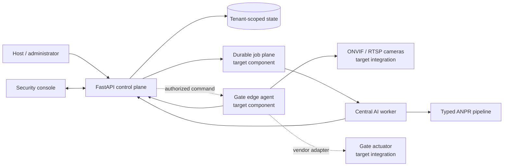

# Campus Access

[](https://github.com/Mohemed-Amine-Chalhy/number-plate-recognition/actions/workflows/ci.yml)

A working, white-label platform prototype for coordinating vehicle access across a large campus.
It combines a typed Moroccan number-plate recognition pipeline with a multi-tenant control API,
a map-led security console, explicit approvals, gate and camera health, incidents, and documented
paths from a laptop demo to a real multi-site deployment.


> “As a UM6P student, I once spent hours waiting at a campus gate because security staff could not
> locate the email containing my vehicle authorization. I later worked with campus stakeholders to
> map the existing process, understand the needs of administrators and security officers, and
> design a faster, AI-assisted alternative.”

That is the project author's supplied account and motivation; it has not been independently
verified. The journey map, stakeholder dates, themes, sketches, rejected alternatives, and
prototype feedback in this repository are clearly marked **illustrative/composite**, not presented
as interviews that actually occurred. This preserves an inspectable design process without
manufacturing research evidence.

## What is working

| Capability | Implementation |
| --- | --- |
| Multi-organization control plane | FastAPI, strict Pydantic contracts, tenant-scoped repositories, role checks, OpenAPI, health/readiness, and SQLite WAL persistence. |
| Multi-gate operations | Organizations, sites, gates, cameras, requests, grants, passages, recognition observations, authorization decisions, incidents, device health, and event polling. |
| Security console | Responsive command center, gate workspace, approvals, people/vehicles, operations, analytics, and a four-step campus setup flow. |
| Operator safety | Recognition evidence is separate from authorization; physical commands remain visibly simulated until an actuator endpoint is configured. |
| AI boundary | The existing three-stage YOLO pipeline is exposed through a versioned, JSON-safe inference-worker contract and a gate simulator. |
| White label | Tenant name, logo, colors, locale, time zone, API base URL, organization, site, and role tokens are configuration. |
| International UI | English, French, and Arabic; real right-to-left layout; light/dark themes; keyboard focus, reduced motion, mobile navigation, and print rules. |
| Engineering delivery | Locked Python environments, cross-platform bootstrap/run scripts, diagnostics, type checking, tests, pre-commit/pre-push hooks, CI, and hardened containers. |

The checked-in data is deterministic and synthetic. The UM6P-branded demonstration is included
with author-confirmed permission, but no endorsement or production deployment is implied. Replace
one tenant configuration and logo asset to present the same platform for another organization.

## Product walkthrough

The command center gives security staff one place to see queues, pending reviews, device health,
recent recognition events, and the operational state of every gate.


At a gate, the console shows the camera observation, recognition confidence, matched access
profile, time window, and camera health together. A match is still only evidence. The platform
records a separate policy or human authorization decision before any future actuator integration.


Administrators resolve typed, time-bounded access requests instead of asking gate staff to search
email threads. Role switching in the demo makes the permission boundary visible; production auth
is deliberately listed as a deployment integration, not disguised behind hard-coded credentials.

The complete two-minute demonstration package includes a timed voiceover, shot list, captions,
truthfulness checklist, and deterministic recording runbook:

- [Watch the generated two-minute MP4](docs/platform/video/campus-access-case-study-2m-v1.mp4)
- [Video package](docs/platform/video/README.md)
- [Storyboard and voiceover](docs/platform/video/storyboard.md)
- [Recording guide](docs/platform/video/recording-guide.md)
- [WebVTT captions](docs/platform/video/captions.vtt)

Regenerate the video after UI changes with:

```bash
uv run --group media --frozen python scripts/build_demo_video.py
```

## Quick start: full platform

Requirements: Python 3.12, [`uv`](https://docs.astral.sh/uv/), and Node.js 18 or newer for console
tests. From the repository root:

PowerShell:

```powershell
.\scripts\bootstrap_platform.ps1
.\scripts\run_platform.ps1
```

Bash:

```bash
bash scripts/bootstrap_platform.sh
bash scripts/run_platform.sh
```

Open <http://127.0.0.1:8000>. The API serves the console from the same origin; OpenAPI is at
<http://127.0.0.1:8000/docs> and readiness is at
<http://127.0.0.1:8000/health/ready>.

The local seed contains two isolated organizations and four gates for the primary campus. These
public demo tokens are intentionally simple and must never be treated as production credentials:

| Demo role | Bearer token |
| --- | --- |
| Platform administrator | `demo-platform` |
| Campus administrator | `demo-admin` |
| Security operator | `demo-operator` |
| Host/coordinator | `demo-host` |
| Operations viewer | `demo-viewer` |
| Edge device | `demo-edge` |

The console selects the appropriate local token when its active role changes. Use the setup screen
to point it at a different API/tenant or edit [`web/console/config.mjs`](web/console/config.mjs) for
a version-controlled deployment preset.

## Run a complete gate event

With the platform running, post a synthetic arrival, recognition observation, grant match, and
authorization decision:

```bash
uv run --frozen python scripts/simulate_gate.py --plate 12345-A-6
```

The output keeps the passage, recognition, and authorization records separate. To exercise the
real manifest-pinned local models instead of synthetic recognition:

```bash
uv run --frozen python scripts/simulate_gate.py --image images/Car1.jpg
```

This is a control-plane integration check, not an accuracy benchmark. The repository's current
demo-image expectations and evaluator remain documented under [Models and evaluation](docs/models.md).

## Architecture



The runnable prototype deliberately has a narrow deployment boundary:

- the console and API are implemented and communicate through typed `/api/v1` contracts;
- SQLite/WAL gives a deterministic single-node demo and backup story;
- the inference worker contract and real model pipeline are implemented locally;
- `simulate_gate.py` stands in for a future edge-to-central delivery path;
- camera discovery/streaming, durable queues, replicated storage, enterprise identity, and physical
  barrier adapters are target integrations for a site pilot.

This distinction matters: detecting plate text, deciding whether a grant applies, and moving a
physical barrier are three different trust boundaries.

## Production path

“Production ready” depends on a real site's topology and risk decisions. The repository implements
the portable application core and records the remaining deployment work instead of pretending a
laptop prototype is a campus installation:

1. Deploy an outbound-only edge agent on each camera network; keep RTSP credentials and frames off
   the public control plane.
2. Replace demo bearer tokens with the organization's OIDC identity provider and mapped roles.
3. Move the control-plane store to PostgreSQL before multiple API replicas; add a durable queue and
   object storage only for retained evidence.
4. Integrate one gate vendor behind an explicit command adapter with operator confirmation,
   idempotency, timeout, and safe fallback.
5. Run shadow mode first, measure queue time and exception reasons, rehearse backup/restore and
   network loss, then enable automation gate by gate.

See [Architecture](docs/platform/architecture.md),
[Deployment runbook](docs/platform/deployment-runbook.md),
[Camera/edge onboarding](docs/platform/camera-edge-onboarding.md), and
[Pilot rollout](docs/platform/pilot-rollout.md).

## Quality gates

Run the complete cross-project gate:

```bash
uv run --frozen python scripts/platform_quality.py check
```

The checks cover formatting, linting, strict mypy, the fast vision suite with branch coverage, the
standalone control API suite, the browser-console contract/static suite, model-manifest integrity,
and environment diagnostics. Pre-commit handles fast file checks; pre-push runs the same integrated
quality boundary used by CI.

Run the real CPU checkpoints explicitly after changing models or inference code:

```bash
uv run --frozen pytest tests/model/test_real_inference.py -m model --no-cov
```

Useful targeted commands:

```bash
uv run --frozen python scripts/platform_doctor.py --api-url http://127.0.0.1:8000
npm --prefix web/console run check
uv run --frozen python scripts/platform_quality.py check --scope service
```

## Containers

Launch the platform control plane and console:

```bash
docker compose up --build control-api
```

The original standalone Streamlit recognizer remains available as the `legacy` profile:

```bash
docker compose --profile legacy up --build app
```

Container defaults use an unprivileged user, dropped capabilities, a read-only root filesystem,
explicit writable runtime mounts, health checks, and environment-driven secrets/configuration.

## Repository map

```text
web/console/                    Dependency-light white-label operations console
services/control_api/           Standalone FastAPI control-plane project and lockfile
services/inference_worker/      Versioned AI worker contract around the recognition core
src/number_plate_recognition/   Typed vehicle → plate → character pipeline
app/streamlit_app.py            Original standalone recognition UI
scripts/                        Bootstrap, run, diagnostics, simulation, evaluation, quality
tests/platform_backend/         Control-plane RBAC, isolation, and workflow tests
tests/platform_inference/       Worker contract and serialization tests
docs/platform/                  Product, research, architecture, ADRs, runbooks, guides, video
models/manifest.json            Checkpoint integrity and semantic contracts
```

## Case study and documentation

- [Platform documentation index](docs/platform/README.md)
- [Product overview](docs/platform/product-overview.md)
- [Research and evidence disclosure](docs/platform/research-and-evidence.md)
- [Design evolution and decision traceability](docs/platform/design-evolution.md)
- [Data model and workflows](docs/platform/data-and-workflows.md)
- [API overview](docs/platform/api-overview.md)
- [Operator guide](docs/platform/guides/operator.md)
- [Administrator guide](docs/platform/guides/admin.md)
- [Host guide](docs/platform/guides/host.md)
- [Backup and restore](docs/platform/backup-restore.md)
- [Troubleshooting](docs/platform/troubleshooting.md)
- [Architecture decision records](docs/platform/adrs/README.md)

The original inference-specific material remains available in
[Architecture](docs/architecture.md), [Configuration](docs/configuration.md),
[Testing](docs/testing.md), and [Deployment](docs/deployment.md).

## License

Repository-authored source code is available under the [MIT License](LICENSE).
