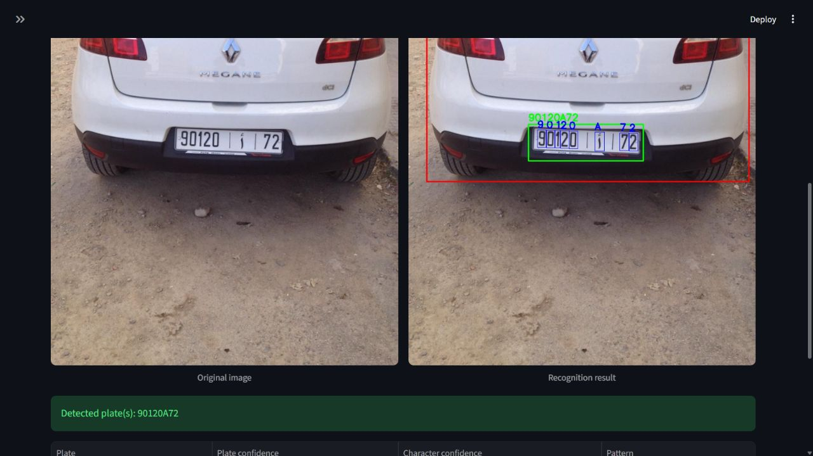
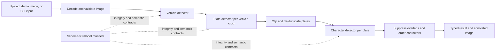

# Moroccan Number Plate Recognition

[](https://github.com/Mohemed-Amine-Chalhy/number-plate-recognition/actions/workflows/ci.yml)

A typed, testable computer-vision application that detects vehicles, locates Moroccan number plates, and reconstructs plate text through a three-stage YOLO pipeline. Streamlit and a packaged CLI are thin adapters over the same framework-independent inference package.



## Engineering highlights

| Area | Implementation |
| --- | --- |
| Architecture | Thin Streamlit adapter over a typed domain package with explicit detector boundaries. |
| Inference | Bounded vehicle → plate → character cascade with clipping, de-duplication, overlap suppression, and deterministic ordering. |
| Model contracts | SHA-256/size verification plus task, class, and output-mapping validation before predictions enter the pipeline. |
| Reliability | Explicit submission, defensive image decoding, byte/pixel/cascade limits, user-safe errors, and request queue timing. |
| Developer experience | Python 3.12, `uv`, locked dependencies, cross-platform bootstrap/run scripts, environment diagnostics, and pre-commit/pre-push hooks. |
| Quality | Ruff, strict mypy, branch coverage, unit/integration/UI tests, real-checkpoint smoke tests, Linux/Windows CI, and container checks. |
| Delivery | CPU-first non-root container, read-only-compatible filesystem, health check, and offline model loading. |

## Pipeline



All cascade stages have configurable limits. A bundle-wide lock serializes complete requests because the three model objects are shared in-process; queue time is reported separately from detector time.

## Quick start

Requirements:

- Python 3.12
- [`uv`](https://docs.astral.sh/uv/getting-started/installation/)
- PowerShell on Windows or Bash on Linux/macOS

Clone the repository, then bootstrap and launch it from the repository root.

PowerShell:

```powershell
.\scripts\bootstrap.ps1
.\scripts\run_app.ps1
```

Bash:

```bash
bash scripts/bootstrap.sh
bash scripts/run_app.sh
```

Open <http://localhost:8501>. A clean checkout includes three tracked inputs—`images/Car1.jpg`, `images/Car2.jpg`, and `images/Car3.jpg`—which can be run from the **Demo image** selector in the sidebar. You can also upload JPEG or PNG files through the explicit submission form.

For the quickest end-to-end check, run the packaged CLI without starting a browser:

```bash
uv run npr-recognize images/Car1.jpg images/Car2.jpg images/Car3.jpg --output-dir outputs/demo
```

It prints deterministic JSON and writes annotated PNGs. The checked-in real-model test asserts these current demo results:

| Input | Reconstructed plate |
| --- | --- |
| `Car1.jpg` | `90120A72` |
| `Car2.jpg` | `1678E1` |
| `Car3.jpg` | `45296B6` |

If startup fails, run the diagnostic:

```bash
uv run python scripts/doctor.py
```

The launch scripts keep Ultralytics runtime state under ignored `.runtime/`, disable dependency/model auto-installation, and run entirely from the manifest-pinned local checkpoints.

## Quality checks

Run the core local and pre-push gate:

```bash
uv run python scripts/quality.py check
```

Or run individual tools:

```bash
uv run ruff format --check .
uv run ruff check .
uv run mypy
uv run pytest
uv run pre-commit run --all-files
```

The fast suite uses synthetic arrays and detector fakes, so it does not deserialize the real checkpoints. CI enforces at least 85% line and branch coverage for project code. When a model, adapter, or inference boundary changes, run the real-model CPU smoke explicitly:

```bash
uv run pytest tests/model/test_real_inference.py -m model --no-cov
```

That test verifies all three checkpoint hashes, loads every detector, checks a blank-frame baseline, and runs the complete pipeline against all three demo images with exact expected text. See [Testing](docs/testing.md) for the full test matrix.

## Container

```bash
docker build --tag number-plate-recognition:local .
docker run --rm --publish 8501:8501 number-plate-recognition:local
```

Or use the hardened local Compose profile:

```bash
docker compose up --build
```

The container runs as an unprivileged user, verifies the model inventory before startup, and exposes Streamlit's health endpoint at `/_stcore/health`. Details are in [Deployment](docs/deployment.md).

## Repository layout

```text
app/                           Streamlit presentation adapter
src/number_plate_recognition/  Typed inference and domain package
tests/                         Unit, integration, UI, and model smoke tests
models/manifest.json           Model integrity and semantic contracts
images/                        Tracked demo inputs
scripts/                       Bootstrap, diagnostics, evaluation, quality, and run tools
docs/                          Architecture and engineering guides
```

## Technical trade-offs

- CPU inference is the reproducible default; GPU support requires a pinned and tested CUDA/PyTorch combination.
- Complete requests are serialized within one process to protect shared model instances. Higher throughput should use measured multi-process or multi-replica scaling.
- Streamlit provides a fast interactive adapter and `npr-recognize` provides deterministic batch JSON, while the core package remains UI-independent for testing and future API adapters.
- The three demo assertions prove a narrow end-to-end path, not statistical recognition quality. The repository includes an evaluator, but no representative benchmark is bundled.
- PyTorch `.pt` checkpoints are pickle-backed executable inputs, so the application loads only manifest-pinned local files with offline/auto-install behavior disabled.

## Reviewer guide

For a focused review:

1. Start with [`pipeline.py`](src/number_plate_recognition/pipeline.py) and [`domain.py`](src/number_plate_recognition/domain.py) for orchestration and result contracts.
2. Review [`ultralytics.py`](src/number_plate_recognition/adapters/ultralytics.py) and [`model_registry.py`](src/number_plate_recognition/model_registry.py) for the third-party and artifact boundaries.
3. Review [`imaging.py`](src/number_plate_recognition/imaging.py) and [`postprocessing.py`](src/number_plate_recognition/postprocessing.py) for deterministic boundary logic.
4. Review [`tests/`](tests/) and [Testing](docs/testing.md) for the verification strategy.
5. Review [`ci.yml`](.github/workflows/ci.yml), [`pyproject.toml`](pyproject.toml), and [Development](docs/development.md) for automation and maintainability.

## Documentation

- [Architecture](docs/architecture.md)
- [Configuration](docs/configuration.md)
- [Development](docs/development.md)
- [Models and evaluation](docs/models.md)
- [Testing](docs/testing.md)
- [Deployment](docs/deployment.md)
- [Troubleshooting](docs/troubleshooting.md)
- [Contributing](CONTRIBUTING.md)

## License

Repository-authored source code is available under the [MIT License](LICENSE).
