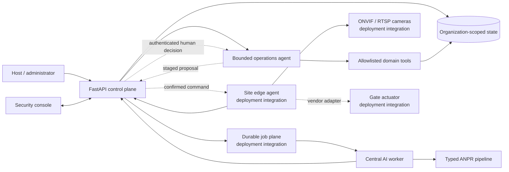

# Campus Access

[](https://github.com/Mohemed-Amine-Chalhy/number-plate-recognition/actions/workflows/ci.yml)

Campus Access is an agentic, campus-scale vehicle operations platform that connects host requests,
multi-gate coordination, Moroccan number-plate recognition, device health, incidents, and
operational analytics in one traceable workflow. Its bounded operations agent can gather gate
context through typed tools, but a human must approve every consequential action.

The motivating failure is simple: a vehicle reaches the gate, but its access context is buried in
an email thread. The system replaces that fragmented handoff with shared, typed state from request
and arrival through review, incident response, and operations.


## Platform at a glance

| Capability | Implementation |
| --- | --- |
| Multi-organization control plane | FastAPI, strict Pydantic contracts, organization-scoped repositories, role checks, OpenAPI, health/readiness, and SQLite WAL persistence. |
| Multi-gate operations | Organizations, sites, gates, cameras, access requests, grants, passages, recognition observations, access decisions, incidents, device health, and event polling. |
| Security console | Responsive command center, gate workspace, access review, people and vehicles, operations, analytics, and guided campus setup. |
| Decision integrity | Recognition and access decisions are separate records with explicit actors, reasons, and timestamps; physical control stays behind a configurable adapter. |
| AI integration | The three-stage YOLO pipeline is available through a versioned, JSON-safe inference-worker contract and an end-to-end gate simulator. |
| Agentic operations | The fixed `gate_health_triage` intent selects a deterministic typed trajectory that executes allowlisted read tools, stages incident creation or investigation for approval, and persists its policy checks, tool results, human decision, and audit trail. The objective is retained as operator context, not interpreted as instructions. |
| White-label delivery | Tenant identity, logo, colors, locale, time zone, API location, organization, site, and role mapping are configuration. |
| International interface | English, French, and Arabic with right-to-left layout, light/dark themes, keyboard focus, reduced motion, mobile navigation, and print styles. |
| Engineering workflow | Locked environments, cross-platform bootstrap/run scripts, diagnostics, strict type checking, tests, pre-commit/pre-push hooks, CI, and hardened containers. |

## Product walkthrough

The command center gives a security team one operating picture for queues, pending reviews, device
health, recent recognition events, and six configured gates. Its local illustrated footprint is
derived from the project author's annotated campus boundary and gate reference; selecting a marker
moves directly into the corresponding gate workspace.


The gate workspace combines the current plate observation, model confidence, matching access
context, time window, and camera health. Operators can review the evidence, stage a confirmed lane
or intercom command through the integration seam, or move into the exception workflow without
changing systems.

A dedicated Agent workspace launches bounded triage for a selected gate. The fixed intent—not the
free-form objective—selects the versioned five-step trajectory; the objective remains visible as
operator context. The runtime retrieves gate state, latest device health, and existing incidents
through explicit tools, then shows the plan and trace. If an incident is warranted, it pauses at a
visible approval boundary; approving executes the staged incident tool, while rejection records the
reason and changes no operational state.


Hosts and administrators use typed, time-bounded requests instead of passing free-form messages
between teams. Operations adds incident ownership and device heartbeat; analytics provides a shared
view of volume, decision mix, latency, and gate utilization.

The interface ships with English, French, and Arabic/RTL presentation and a replaceable tenant
configuration, so the same product surface can serve another organization without changing domain
logic. A deterministic generated dataset keeps the walkthrough, screenshots, and local review
reproducible; the [workflow analysis](docs/platform/research-and-evidence.md) records its design
inputs.

The complete two-minute walkthrough is reproducible from version-controlled screenshots, captions,
and a timed build script:

- [Watch the generated two-minute MP4](docs/platform/video/campus-access-case-study-2m-v1.mp4)
- [Video package](docs/platform/video/README.md)
- [Storyboard and voiceover](docs/platform/video/storyboard.md)
- [Recording guide](docs/platform/video/recording-guide.md)
- [WebVTT captions](docs/platform/video/captions.vtt)

Regenerate it after UI changes with:

```bash
uv run --group media --frozen python scripts/build_demo_video.py
```

## Quick start

Requirements: Python 3.12, [`uv`](https://docs.astral.sh/uv/), and Node.js 18 or newer for console
tests. From the repository root:

PowerShell:

```powershell
.\scripts\bootstrap_platform.ps1
.\scripts\run_platform.ps1
```

Bash:

```bash
bash scripts/bootstrap_platform.sh
bash scripts/run_platform.sh
```

Open <http://127.0.0.1:8000>. The API serves the console from the same origin; OpenAPI is at
<http://127.0.0.1:8000/docs> and readiness is at
<http://127.0.0.1:8000/health/ready>.

The reference seed contains two isolated organizations and six gates for the primary campus. The
local role fixtures make the permission boundary easy to exercise:

| Local role | Bearer token |
| --- | --- |
| Platform administrator | `demo-platform` |
| Campus administrator | `demo-admin` |
| Security operator | `demo-operator` |
| Host/coordinator | `demo-host` |
| Operations viewer | `demo-viewer` |
| Edge device | `demo-edge` |

These tokens are local fixtures, not production credentials. The console selects the matching token
when its active role changes. Use the setup screen to connect another API/tenant or edit
[`web/console/config.mjs`](web/console/config.mjs) for a version-controlled deployment preset.

## Run a complete gate event

With the platform running, post a generated arrival, recognition observation, grant match, and
access decision:

```bash
uv run --frozen python scripts/simulate_gate.py --plate 12345-A-6
```

To exercise the manifest-pinned local models instead of generated recognition:

```bash
uv run --frozen python scripts/simulate_gate.py --image images/Car1.jpg
```

This command verifies the control-plane integration path. The repository's image expectations and
evaluator remain documented under [Models and evaluation](docs/models.md).

## Run bounded agentic triage

With the platform running, start a deterministic, tenant/gate-scoped agent run:

```bash
curl -X POST http://127.0.0.1:8000/api/v1/agent/runs \
  -H "Authorization: Bearer demo-operator" \
  -H "Content-Type: application/json" \
  -d '{
    "objective": "Inspect north-gate health and prepare a reviewed incident response",
    "gate_id": "gate-atlas-north",
    "intent": "gate_health_triage",
    "idempotency_key": "readme-north-triage-001"
  }'
```

The `gate_health_triage` intent selects one fixed, versioned plan; the runtime stores the objective
as operator context and does not interpret or decompose it. It executes only the registered read
tools and either completes without action or returns `awaiting_approval` with one staged incident
action. It cannot execute that action until an authenticated human posts an approve/reject decision
with a reason and a separate idempotency key. Open `/#/agent` to inspect the same plan, tool evidence,
policy checks, and audit trail in the console. The
[agentic operations guide](docs/platform/agentic-ai.md) includes the decision contract, failure
matrix, evaluation strategy, and safe-extension checklist.

## Architecture



The runnable application core includes the console, typed `/api/v1` control plane, organization-
scoped persistence, bounded agent runtime, inference contract, real local model path, and end-to-end
simulator. SQLite/WAL keeps local review, agent traces, and backup deterministic.

The operational agent and perception worker are deliberately separate. ANPR produces an
observation; the agent can assemble operational context; policy and a human still govern
consequential state changes. See [Agentic AI architecture and operations](docs/platform/agentic-ai.md)
for tool contracts, tenant scope, failure semantics, evaluations, and extension rules.

A site rollout supplies deployment-specific integrations: enterprise identity, PostgreSQL for
replicated APIs, a durable queue, edge camera connectivity, retained-object storage, and a vendor
barrier adapter. These seams are designed and documented without coupling the application core to
one campus network or hardware vendor.

See [Architecture](docs/platform/architecture.md),
[Deployment runbook](docs/platform/deployment-runbook.md),
[Camera/edge onboarding](docs/platform/camera-edge-onboarding.md), and
[Pilot rollout](docs/platform/pilot-rollout.md).

## Engineering quality

Run the cross-project quality gate:

```bash
uv run --frozen python scripts/platform_quality.py check
```

It covers formatting, linting, strict mypy, the fast vision suite with branch coverage, the
standalone control API suite—including agent policy, idempotency, and tenant-boundary tests—the
browser-console contract/static suite, model-manifest integrity, and environment diagnostics.
Pre-commit handles fast file checks; pre-push runs the integrated quality boundary used by CI.

Run the real CPU checkpoints explicitly after changing models or inference code:

```bash
uv run --frozen pytest tests/model/test_real_inference.py -m model --no-cov
```

Useful targeted commands:

```bash
uv run --frozen python scripts/platform_doctor.py --api-url http://127.0.0.1:8000
npm --prefix web/console run check
uv run --frozen python scripts/platform_quality.py check --scope service
uv run --project services/control_api --frozen python -m control_api.agent_evals
```

## Containers

Launch the control plane and console:

```bash
docker compose up --build control-api
```

The original standalone Streamlit recognizer remains available as the `legacy` profile:

```bash
docker compose --profile legacy up --build app
```

Container defaults use an unprivileged user, dropped capabilities, a read-only root filesystem,
explicit writable runtime mounts, health checks, and environment-driven secrets/configuration.

## Repository map

```text
web/console/                    Dependency-light white-label operations console
services/control_api/           Standalone FastAPI control-plane project and lockfile
services/inference_worker/      Versioned AI worker contract around the recognition core
services/control_api/control_api/agentic.py  Bounded planner, tool registry, policy, and workflow
services/control_api/control_api/agent_evals.py  Versioned deterministic agent evaluation matrix
src/number_plate_recognition/   Typed vehicle → plate → character pipeline
app/streamlit_app.py            Original standalone recognition UI
scripts/                        Bootstrap, run, diagnostics, simulation, evaluation, quality
tests/platform_backend/         Control-plane role, isolation, and workflow tests
tests/platform_inference/       Worker contract and serialization tests
docs/platform/                  Product, design, architecture, runbooks, guides, and video
models/manifest.json            Checkpoint integrity and semantic contracts
```

## Documentation

- [Platform documentation index](docs/platform/README.md)
- [Product overview](docs/platform/product-overview.md)
- [Workflow analysis and design inputs](docs/platform/research-and-evidence.md)
- [Design evolution and decision traceability](docs/platform/design-evolution.md)
- [Architecture](docs/platform/architecture.md)
- [Agentic AI architecture and operations](docs/platform/agentic-ai.md)
- [Data model and workflows](docs/platform/data-and-workflows.md)
- [API overview](docs/platform/api-overview.md)
- [Operator guide](docs/platform/guides/operator.md)
- [Administrator guide](docs/platform/guides/admin.md)
- [Host guide](docs/platform/guides/host.md)
- [Backup and restore](docs/platform/backup-restore.md)
- [Troubleshooting](docs/platform/troubleshooting.md)
- [Architecture decision records](docs/platform/adrs/README.md)

The original inference-specific material remains available in
[Architecture](docs/architecture.md), [Configuration](docs/configuration.md),
[Testing](docs/testing.md), and [Deployment](docs/deployment.md).

## License

Repository-authored source code is available under the [MIT License](LICENSE).
