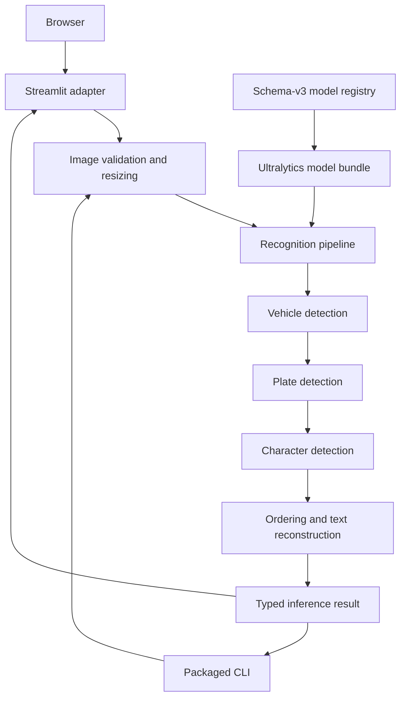

# Architecture

The project is a stateless, CPU-first image recognition application. Thin Streamlit and CLI adapters handle input and presentation while a typed Python package owns configuration, image validation, model adapters, orchestration, post-processing, and results.

## Component view

The dependency direction is presentation adapters → application/domain → model adapter. Streamlit and the CLI are sibling entry points over the same imaging and pipeline code. Domain and post-processing modules import neither Streamlit nor Ultralytics, keeping deterministic behavior fast to test and presentation-independent.

## Package boundaries

| Module | Responsibility |
| --- | --- |
| `app/streamlit_app.py` | Upload/local-example controls, explicit submission, presentation, and user-safe errors. |
| `cli.py` | Batch-oriented image input, deterministic JSON, and optional annotated PNG output. |
| `config.py` | Parse and validate environment-based configuration. |
| `domain.py` | Project-owned boxes, detections, plate results, timings, and inference results. |
| `imaging.py` | Decode JPEG/PNG input, correct orientation, validate byte/pixel bounds, and resize without upscaling. |
| `model_registry.py` | Parse schema v3 and verify artifact integrity and semantic contracts. |
| `adapters/ultralytics.py` | Isolate third-party loading/result shapes and normalize predictions into typed detections. |
| `pipeline.py` | Coordinate the bounded cascade, filtering, clipping, de-duplication, locking, and timings. |
| `postprocessing.py` | Suppress character overlaps, order detections, map labels, and evaluate the configured pattern. |
| `evaluation.py` | Compare structured predictions with expected strings. |
| `observability.py` | Emit bounded structured events and timings. |
| `errors.py` | Define project error categories at external boundaries. |

## Request lifecycle

1. The user selects uploaded files or a tracked demo image and explicitly starts recognition, or invokes the packaged CLI with one or more paths.
2. The UI rejects an oversized batch before inference.
3. The imaging layer validates encoded bytes, decoded pixels, image format, and dimensions; it applies EXIF orientation and normalizes color space.
4. The request waits for the shared model bundle lock. Queue time starts before lock acquisition.
5. The image is resized to the configured longest side while preserving aspect ratio and never upscaling.
6. Vehicle predictions are validated, clipped, confidence-ranked, filtered to supported classes, and capped.
7. Plate detection runs on bounded vehicle crops. Boxes are translated to image coordinates, clipped, ranked, capped, and de-duplicated.
8. Character detection runs on each retained plate crop. Class-agnostic overlap suppression removes duplicate symbols.
9. Characters are ordered left-to-right and decoded through the manifest's output mapping.
10. The pipeline returns an annotated RGB image, structured detections, reconstructed strings, model identifiers, and queue/stage/total timings.

Empty detections are valid results. The pipeline never invents a character to satisfy the configured pattern.

## Model boundary

The model manifest describes exactly three roles: `vehicle`, `plate`, and `character`. Each entry pins the file by size and SHA-256 and declares its expected task/classes. The adapter verifies the loaded model against that contract and filters predictions to declared class IDs.

Ultralytics runs offline with dependency/model auto-installation disabled. This prevents an inference request from changing the environment or selecting an unexpected checkpoint.

## State and concurrency

Model objects are cached in-process because checkpoint loading is expensive. Request payloads and results are not added to that global cache.

A bundle-wide re-entrant lock serializes a complete three-stage request, preventing interleaved access to shared model objects. `queue_ms` exposes contention separately from detector latency. If one-request-per-process throughput becomes limiting, scale with isolated processes or replicas after measuring model memory and startup cost.

## Failure model

- Invalid input becomes a request error and does not terminate the process.
- The container entrypoint rejects missing or corrupt model artifacts before serving; direct entry points fail during pipeline initialization on their first recognition request.
- Loaded task/class mismatches fail when models initialize.
- Non-finite, unsupported, low-confidence, and out-of-range predictions are discarded at the adapter/pipeline boundary.
- Empty or invalid crops never reach downstream models.
- Backend exceptions are logged with a request identifier and displayed as bounded user-safe messages.
- `/_stcore/health` reports process liveness; model-aware readiness requires an explicit warm-up inference.

## Key trade-offs

- Streamlit keeps the interactive adapter small, but its liveness endpoint does not eagerly initialize models.
- Serial inference favors correctness and predictable shared-model access over maximum per-process throughput.
- A three-model cascade is explainable and independently testable, but errors from an early stage prevent later stages from seeing the missed region.
- Conservative input/cascade caps bound work at the cost of potentially discarding crowded or very high-resolution cases.
