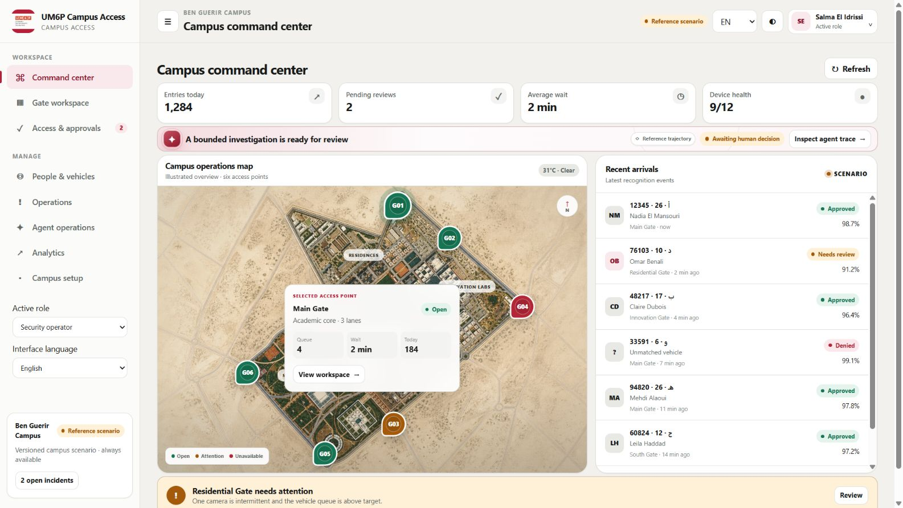
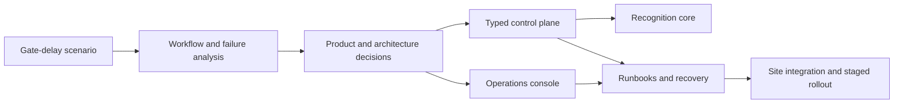

# Campus Access Platform

Campus Access develops a Moroccan number-plate recognition pipeline into a multi-organization,
multi-gate agentic operations product. This documentation connects the product rationale to the
runnable console, bounded agent runtime, control plane, deployment topology, and operating
practices needed for a site rollout.

## Start with the product

1. [Product overview](product-overview.md) — the problem, users, workflows, and product boundaries.
2. [Workflow analysis and design inputs](research-and-evidence.md) — the modeled process and failure
   modes that shaped the system.
3. [Design evolution](design-evolution.md) — sketches, rejected alternatives, and traceable design
   decisions.
4. [Agentic AI architecture and operations](agentic-ai.md) — tools, policy, human approval,
   traceability, evaluations, failure semantics, and safe extension.
5. [Generated two-minute walkthrough](video/campus-access-case-study-2m-v1.mp4) — the working product
   surface from command center to operations.

## Explore the engineering

| Area | Document | What it explains |
| --- | --- | --- |
| System design | [Architecture](architecture.md) | Console, control plane, inference, edge, cameras, storage, and failure boundaries |
| Agentic system | [Agentic AI architecture and operations](agentic-ai.md) | Intent-selected fixed trajectory, retained operator context, bounded autonomy, human decisions, traces, evaluations, and failure modes |
| Domain model | [Data model and workflows](data-and-workflows.md) | Organizations, gates, requests, grants, passages, observations, decisions, incidents, and events |
| Contracts | [API overview](api-overview.md) | Resources, roles, tenant scope, event polling, and edge/worker integration seams |
| Security | [Security and privacy](security-and-privacy.md) | Threat boundaries, isolation, credentials, media, actuation, and audit records |
| Deployment | [Deployment runbook](deployment-runbook.md) | Bootstrap, configuration, health checks, rollout, rollback, and handover |
| Site connectivity | [Camera and edge onboarding](camera-edge-onboarding.md) | Camera discovery, capture profiles, edge enrollment, health, and calibration |
| Recovery | [Backup and restore](backup-restore.md) | Backup verification, restore drills, and storage evolution |
| Diagnostics | [Troubleshooting](troubleshooting.md) | UI, API, database, edge, and recognition failure isolation |
| Decisions | [Architecture decision records](adrs/README.md) | Consequential choices and the alternatives considered |

## Operate the product

- [Security operator guide](guides/operator.md)
- [Campus administrator guide](guides/admin.md)
- [Host/coordinator guide](guides/host.md)
- [Pilot and rollout plan](pilot-rollout.md)

## Product media

- [Screenshot gallery](assets/README.md)
- [Two-minute video package](video/README.md)
- [Storyboard and timed script](video/storyboard.md)
- [Deterministic recording guide](video/recording-guide.md)
- [WebVTT captions](video/captions.vtt)

The gallery covers the six-gate command center, gate workspace, request review, operations and device
health, organization setup, and mobile Arabic/RTL Agent Operations behavior. The command-center footprint is a local
illustrated asset derived from the project author's annotated campus boundary and gate reference;
gate status and selection remain interactive data layers.

## From problem to platform

The progression is visible in the repository: an image-focused recognizer becomes a control plane
with organization-scoped state, a task-based security console, a versioned AI-worker boundary, a
bounded tool-using operations agent, an end-to-end gate simulator, and documented edge/deployment
seams. Perception, agent planning, policy, human authority, and physical actuation remain distinct
boundaries.

## Implementation map

| Surface | Status in this repository | Deployment extension |
| --- | --- | --- |
| Typed recognition core | Runnable | Calibrate with site-specific cameras and conditions |
| Operations console | Runnable | Connect enterprise identity and deployment configuration |
| FastAPI control plane | Runnable | Move replicated deployments to PostgreSQL and managed secrets |
| Organization/site/gate model | Runnable with a six-gate reference campus | Load the deployment topology and operating policy |
| Inference-worker contract | Runnable locally | Attach a durable job broker and centrally managed workers |
| Bounded operations agent | Runnable `gate_health_triage` flow | Evaluate model-backed planning and distributed execution without widening tool authority |
| Agent evaluation matrix | Runnable six-scenario, versioned JSON report | Extend with field-grounded and adversarial trajectories before model-backed planning |
| Gate event simulator | Runnable | Replace generated/local-image input with an enrolled site edge agent |
| ONVIF/RTSP connectivity | Designed integration seam | Implement and validate on the camera network |
| Barrier control | Designed adapter boundary | Integrate one vendor with expiry, idempotency, and acknowledgement |

This split keeps the application core easy to review while making the remaining site work explicit
and independently deployable. Product media and local review use the same version-controlled
reference dataset described in the [workflow analysis](research-and-evidence.md).

## White-label configuration

The included UM6P-themed reference configuration is replaceable. Tenant identity, palette, logo,
locale, time zone, API location, organization, and site are isolated from domain logic. See the
[product overview](product-overview.md#white-label-delivery),
[administrator guide](guides/admin.md#branding-language-and-time-zone), and
[ADR-0005](adrs/0005-white-label-deterministic-demo.md).
