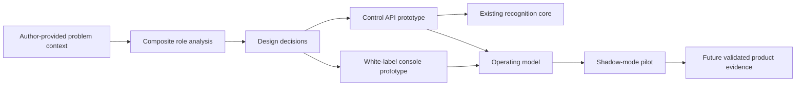

# Campus Access Platform documentation

This documentation describes the campus access platform case study built around the repository's
Moroccan number-plate recognition pipeline. It covers the product rationale, prototype, target
architecture, operating model, and a reproducible two-minute demonstration.

The platform is presented with authorized UM6P demonstration branding. The application remains
white-label: tenant identity, colors, locale, time zone, and API location are configuration, not
domain logic. See [Product overview](product-overview.md#white-label-positioning) and the
[administrator guide](guides/admin.md#branding-language-and-time-zone).

## Read this first: evidence and status labels

This is an engineering case study, not a claim of completed field research or a live campus
deployment.

| Label | Meaning |
| --- | --- |
| **Implemented** | Behavior represented in repository code and intended to be executable. |
| **Prototype** | A demonstrator-quality interaction or local component; not a production-service claim. |
| **Target** | An architectural or operational direction that has not necessarily been implemented. |
| **Author-provided context** | First-person motivation supplied by the project author; not independently verified. |
| **Illustrative/composite** | Synthesized role, date, quotation, journey, or feedback used to make design reasoning inspectable. It is not a record of an actual interview or observed individual. |

The complete methodology and its limitations are in
[Research and evidence](research-and-evidence.md). Demo identities, plates, metrics, incidents, and
timestamps are synthetic; see [Demo-data disclosure](video/demo-data-disclosure.md).

## Paths through the documentation

### Product and design reviewers

1. [Product overview](product-overview.md)
2. [Research and evidence](research-and-evidence.md)
3. [Design evolution](design-evolution.md)
4. [Pilot and rollout](pilot-rollout.md)

### Engineers and operators

1. [Architecture](architecture.md)
2. [Data model and workflows](data-and-workflows.md)
3. [API overview](api-overview.md)
4. [Security and privacy](security-and-privacy.md)
5. [Deployment runbook](deployment-runbook.md)
6. [Camera and edge onboarding](camera-edge-onboarding.md)

### Product users

- [Operator guide](guides/operator.md)
- [Administrator guide](guides/admin.md)
- [Host guide](guides/host.md)

### Operations and recovery

- [Backup and restore](backup-restore.md)
- [Troubleshooting](troubleshooting.md)
- [Pilot and rollout](pilot-rollout.md)
- [Architecture decision records](adrs/README.md)

### Two-minute case-study video

- [Generated two-minute reference MP4](video/campus-access-case-study-2m-v1.mp4)
- [Video package index](video/README.md)
- [Storyboard, timed script, and shot list](video/storyboard.md)
- [Deterministic recording guide](video/recording-guide.md)
- [Caption file](video/captions.vtt)
- [Demo-data disclosure](video/demo-data-disclosure.md)
- [Deterministic screenshot gallery](assets/README.md)

## Product screenshots

The repository includes command-center, gate-workspace, access-approval, operations/health,
white-label setup, and mobile Arabic/RTL captures in the
[product-media gallery](assets/README.md). They use version-controlled synthetic fixtures. A `LIVE`
label inside the synthetic camera treatment is not a live feed; the page-level **Demo data** badge
and [demo-data disclosure](video/demo-data-disclosure.md) are the claim boundary.

## Product-to-operation map

The arrow into “Future validated product evidence” is intentional: prototype assumptions become
evidence only after real, consented evaluation.

## Documentation map

| Document | Primary question |
| --- | --- |
| [Product overview](product-overview.md) | What is being built, for whom, and where is the scope boundary? |
| [Research and evidence](research-and-evidence.md) | What is known, assumed, composite, and still unverified? |
| [Design evolution](design-evolution.md) | How did findings lead to interface and architecture choices? |
| [Architecture](architecture.md) | How do console, control plane, inference, edge, cameras, and storage fit? |
| [Data and workflows](data-and-workflows.md) | What are the core records, states, and end-to-end flows? |
| [API overview](api-overview.md) | What contracts connect UI, control plane, and future edge/worker components? |
| [Security and privacy](security-and-privacy.md) | Which practical risks and controls matter without certification theater? |
| [Deployment runbook](deployment-runbook.md) | How is a demo or pilot deployed, checked, rolled back, and handed over? |
| [Camera and edge onboarding](camera-edge-onboarding.md) | How is a camera introduced without exposing a campus network? |
| [User guides](guides/operator.md) | How do operators, admins, and hosts complete routine work? |
| [Backup and restore](backup-restore.md) | How is state recovered and verified? |
| [Troubleshooting](troubleshooting.md) | How are common UI, API, database, edge, and recognition failures isolated? |
| [Pilot and rollout](pilot-rollout.md) | How does the team validate value and safety before automation? |
| [ADRs](adrs/README.md) | Why were consequential technical choices made? |
| [Video package](video/README.md) | How can a truthful, deterministic two-minute case study be recorded? |
| [Product media](assets/README.md) | Which deterministic screenshots are safe to use, and what must remain disclosed? |

## Repository implementation boundary

At the time of this documentation snapshot:

- the typed recognition package under `src/number_plate_recognition` is the reusable inference core;
- `services/control_api` is the self-contained FastAPI/SQLite control-plane prototype;
- `web/console` is the white-label operations-console prototype with deterministic demo data and a
  visible Live API / Partial API / Demo data boundary;
- the site edge agent, ONVIF discovery, RTSP media plane, central job broker, object storage, and
  automatic barrier integration are **target architecture**, not implied completed features.

That boundary is repeated in [Architecture](architecture.md#implementation-status) so a reviewer
can distinguish runnable proof from future design.
