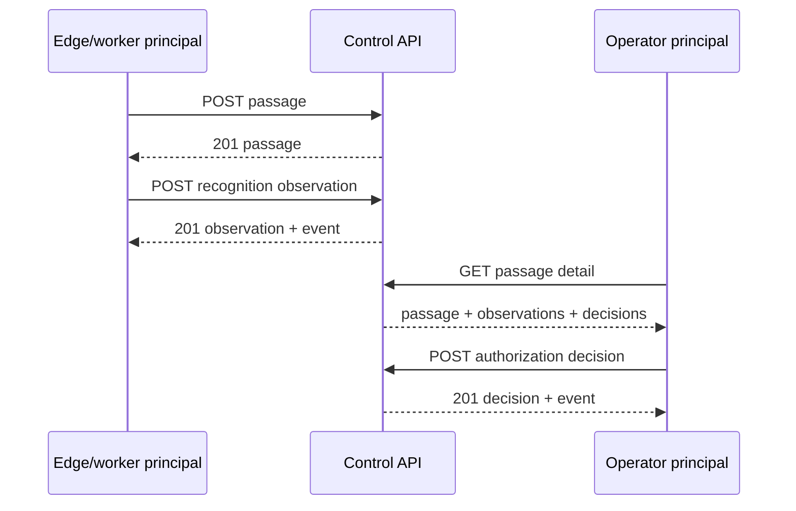

# Control API overview

← [Platform documentation index](README.md)

## Contract status

The FastAPI service under `services/control_api` is a **self-contained prototype control plane**.
Its generated OpenAPI document at `/docs` or `/openapi.json` is the executable source of truth for
the current build. This document explains the intended semantics and boundaries; it does not turn
target edge/worker endpoints into implemented claims.

The browser console calls the canonical control-plane resources and its `api.mjs` adapter normalizes
them into projection-oriented UI models for gates, arrivals, requests, directory, incidents,
devices, and analytics. The adapter—not a second source of truth—owns that vocabulary translation.

## Conventions

- Base path: `/api/v1`
- Media type: `application/json`
- Time: RFC 3339 with an explicit UTC offset; canonical storage in UTC
- IDs: opaque strings; clients must not infer ordering or type from an ID
- Unknown request fields: rejected by typed request models
- Tenant context: authenticated principal by default; deliberate `X-Organization-ID` switch only for
  a platform administrator in the demo API
- Errors: stable problem-shaped response with `type`, `title`, `status`, `detail`, and `instance`
- Lists: bounded `limit`; event stream uses a monotonic sequence cursor
- Mutations: use explicit decision/revoke/command operations for state transitions
- Idempotency: required for capture, job, and physical-command endpoints in the target API

## Authentication warning

The prototype exposes named bearer tokens from `GET /api/v1/demo-identities` so reviewers can test
role boundaries. These tokens are intentional demo fixtures and are not secure credentials.

```bash
curl -H "Authorization: Bearer demo-operator" \
  http://127.0.0.1:8000/api/v1/session
```

A production deployment replaces this mechanism with OIDC access tokens, key rotation, issuer and
audience validation, and server-derived organization/role claims. Never deploy demo tokens on a
publicly reachable service. See [Security and privacy](security-and-privacy.md#identity-and-access).

## Role model

| Role | Intended capability |
| --- | --- |
| `platform_admin` | Manage/switch organizations and all prototype capabilities |
| `org_admin` | Manage its organization's topology, access, passages, decisions, incidents, and health |
| `security_operator` | Read operational state, decide passages, and manage incidents/health |
| `host` | Read permitted context and submit/manage access requests |
| `viewer` | Read-only operational/analytic access |
| `edge_agent` | Ingest passages, recognition observations, and device health |

Permissions are checked server-side. A UI role switcher is only a way to choose a demo bearer token.

## Resource groups

The exact available operations should be read from OpenAPI. The intended resource surface is:

| Group | Representative routes | Notes |
| --- | --- | --- |
| Health | `GET /health/live`, `GET /health/ready` | Liveness is process-only; readiness checks schema/dependencies |
| Demo identity | `GET /api/v1/demo-identities`, `GET /api/v1/session` | Prototype only; never production auth |
| Organizations | `GET/POST /organizations`, `GET/PATCH /organizations/{id}` | Platform-admin boundary for cross-org work |
| Sites | `GET/POST /sites`, `GET/PATCH /sites/{id}` | Organization scoped |
| Gates | `GET/POST /gates`, `GET/PATCH /gates/{id}` | Includes direction, status, and queue estimate |
| Cameras | `GET/POST /cameras`, `GET/PATCH /cameras/{id}` | Metadata only; no camera credential returned |
| Access requests | `GET/POST /access-requests`, `GET/PATCH/DELETE .../{id}`, `POST .../{id}/decision` | Explicit decision; DELETE means cancel, not erase |
| Grants | `GET/POST /access-grants`, `GET .../{id}`, `POST .../{id}/revoke` | Time-bounded and revocable |
| Passages | `GET/POST /passages`, `GET /passages/{id}` | Detail joins observations and decisions |
| Recognition | `POST /passages/{id}/recognitions` | Edge/worker evidence ingest |
| Authorization | `POST /passages/{id}/authorization-decisions` | Policy/operator/system source recorded |
| Events | `GET /events?after_sequence=&limit=` | Append-oriented cursor feed |
| Incidents | `GET/POST /incidents`, `GET/PATCH .../{id}` | Assignment and resolution workflow |
| Device health | `GET/POST /device-health` | Latest/sample health depending query |
| Dashboard | `GET /dashboard` | Bounded operational projection |

The current console derives arrivals, directory entries, and analytics from canonical passages,
grants, events, gates, and dashboard data; it does not require separate `/arrivals`, `/directory`, or
`/analytics/overview` endpoints. If dedicated read-model endpoints are added after measurement,
build them from canonical resources/events rather than creating competing sources of truth.

## Example: create and decide an access request

Create as the demo host:

```bash
curl -X POST http://127.0.0.1:8000/api/v1/access-requests \
  -H "Authorization: Bearer demo-host" \
  -H "Content-Type: application/json" \
  -d '{
    "site_id": "site-atlas-main",
    "requested_for_name": "Demo Visitor",
    "subject_kind": "visitor_vehicle",
    "purpose": "Scheduled project review",
    "plate_text": "12345A26",
    "valid_from": "2026-08-23T09:00:00Z",
    "valid_until": "2026-08-23T12:00:00Z",
    "preferred_gate_id": "gate-atlas-north"
  }'
```

Decide as an administrator using the returned request ID:

```bash
curl -X POST http://127.0.0.1:8000/api/v1/access-requests/REQUEST_ID/decision \
  -H "Authorization: Bearer demo-admin" \
  -H "Content-Type: application/json" \
  -d '{
    "decision": "approved",
    "reason": "Host and access window confirmed",
    "gate_id": "gate-atlas-north"
  }'
```

The decision endpoint owns the transition and grant creation. A generic patch must not be used to
turn `pending` into `approved`.

## Example: ingest recognition, then decide



Recognition request fields include status, optional plate/confidences, format validity, model
version, source, and evidence label. Authorization fields include outcome, reason, source, optional
grant ID, and authenticated decision actor.

For an executable local version of this sequence, start the API against a disposable seeded
database and run:

```powershell
uv run --frozen python scripts/simulate_gate.py --plate 12345-A-6
```

The simulator creates each record through the public API, prints the resulting JSON, and labels its
evidence synthetic/composite. It never actuates a barrier. See the
[deployment runbook](deployment-runbook.md#deterministic-end-to-end-gate-simulation) for confidence,
invalid-format, no-decision, and real-image variants.

## Events and reconnect

A client retains the last processed sequence and asks for later items:

```http
GET /api/v1/events?after_sequence=1042&limit=100
Authorization: Bearer demo-operator
```

The response contains ordered items, `next_sequence`, and `has_more`. Consumers must tolerate
retries and empty pages. A future SSE endpoint can use the same cursor so a reconnect does not lose
events between the live channel and REST catch-up.

## Problem response

Expected domain failures map to stable statuses:

| Status | Meaning |
| --- | --- |
| `401` | Missing/invalid demo bearer token |
| `403` | Authenticated principal lacks permission or tenant scope |
| `404` | Resource absent in the selected organization; also used to avoid cross-tenant existence leaks |
| `409` | Scoped uniqueness/conflicting current state |
| `422` | Invalid payload or invalid state transition |

Example shape:

```json
{
  "type": "urn:campus-control:resource_conflict",
  "title": "Resource conflict",
  "status": 409,
  "detail": "A gate with that code already exists in this site",
  "instance": "/api/v1/gates"
}
```

Unexpected exceptions should receive a correlation ID and a bounded message; SQL, filesystem paths,
camera credentials, tokens, and stack traces must not be returned.

## Target edge API

The following is **target**, not claimed implemented:

- bootstrap a device identity with a short-lived enrollment token, then rotate to mTLS;
- heartbeat and report software/config/spool state;
- fetch desired configuration by monotonic version and acknowledge applied/failed state;
- create a capture, obtain a presigned upload, and complete it idempotently;
- poll/stream expiring commands and acknowledge outcome;
- upload buffered events with agent boot ID and sequence.

Prefer outbound HTTPS/gRPC from the edge agent over exposing the internal broker directly to every
campus network.

## API change discipline

1. Make additive changes inside `/api/v1` where possible.
2. Version asynchronous message schemas independently from HTTP.
3. Commit OpenAPI snapshots/contract tests when the frontend begins generating clients.
4. Test every role and cross-organization access path.
5. Preserve explicit transition endpoints.
6. Deprecate with a measured client inventory and removal date; do not silently reinterpret fields.

## Related documents

- [Data model and workflows](data-and-workflows.md)
- [Security and privacy](security-and-privacy.md)
- [Operator guide](guides/operator.md)
- [Administrator guide](guides/admin.md)
- [Camera and edge onboarding](camera-edge-onboarding.md)
