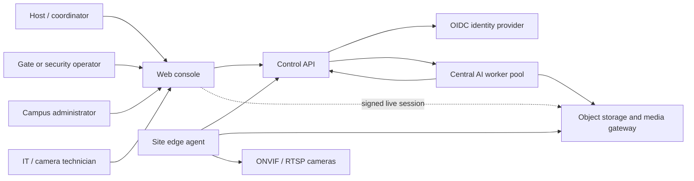
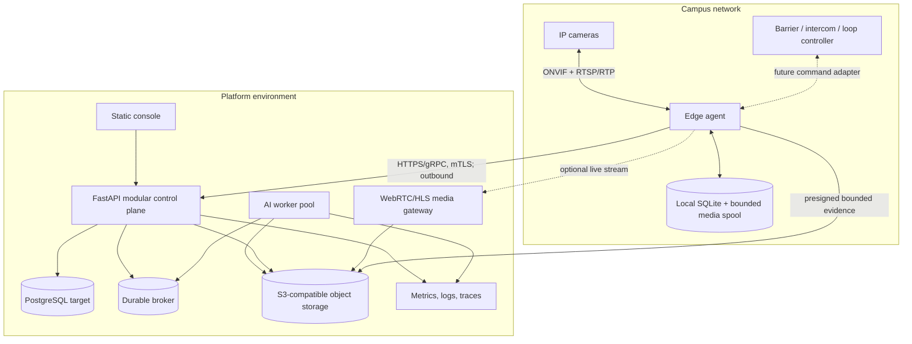
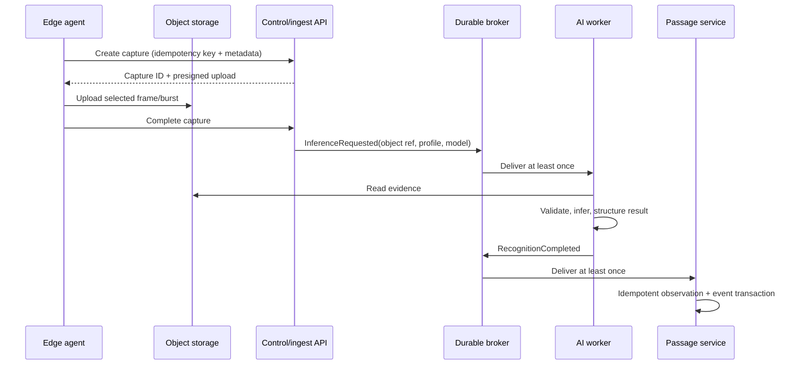
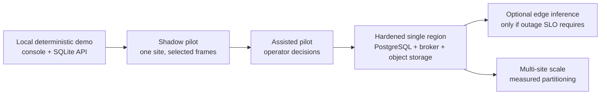

# Platform architecture

← [Platform documentation index](README.md)

## Architecture in one paragraph

The target platform uses a modular control plane for tenant, topology, access, passage, incident,
and event state; separately scaled AI workers for model inference; and an outbound site edge agent
for ONVIF/RTSP cameras and bounded offline buffering. The browser talks only to the control API and
a browser-compatible media gateway. Cameras never talk to the browser or public API directly, and
recognition never actuates a gate by itself.

## Implementation status

| Area | Status in this repository | Boundary |
| --- | --- | --- |
| Typed three-stage recognition pipeline | **Implemented** | Still-image vehicle → plate → character inference under `src/number_plate_recognition` |
| Streamlit and CLI recognition adapters | **Implemented** | Existing model demonstration/debug paths |
| White-label campus console | **Prototype** | Static web console with deterministic demo state and live/demo/hybrid API loading |
| FastAPI control plane | **Prototype** | Self-contained typed service with SQLite domain persistence and demo authentication |
| Multi-organization domain model | **Prototype** | Organization-scoped API/storage records; not a claim of production isolation certification |
| Central asynchronous AI worker | **Target** | Existing inference core must be wrapped in a durable job consumer |
| Site edge agent | **Target** | Outbound camera connector, local spool, health, config, capture selection |
| ONVIF/RTSP integration | **Target** | Capability discovery and stream acquisition are documented, not implemented here |
| Object storage and media gateway | **Target** | Evidence objects and WebRTC/HLS preview remain separate deployables |
| Automatic barrier controller | **Out of initial scope** | Requires a distinct fail-safe edge actuator and pilot authorization |

This table is the guardrail against presenting target diagrams as completed deployment.

## System context

Solid edges are application/control relationships. The dotted live-view relationship is optional
and does not expose the RTSP URI to the browser.

## Planes and trust boundaries

### Browser plane

- Renders task-based views and localized content.
- Uses generated/versioned HTTP contracts in a production build.
- Never receives camera passwords, RTSP URLs, model objects, or database access.
- Treats client-side role visibility as usability only; the API remains authoritative.

### Control plane

- Owns organization, site, gate, camera metadata, requests, grants, passages, decisions, incidents,
  device state, and event queries.
- Validates organization scope and permissions at every external boundary.
- Issues asynchronous operations instead of holding HTTP requests open for camera/model work.
- Stores metadata in PostgreSQL in a production topology; SQLite is the local demonstrator adapter.

### Inference data plane

- Receives a durable job containing an object reference, capture metadata, inference profile, and
  idempotency key—not a large image embedded in a broker message.
- Loads a validated model bundle once per worker process/device.
- Returns structured observations with model bundle and configuration identities.
- Produces optional annotation media separately from the canonical structured result.

### Site edge plane

- Runs on the camera LAN and initiates outbound authenticated connections.
- Discovers/configures cameras, maintains RTSP sessions, selects frames/bursts, reports health, and
  keeps a bounded local spool.
- Applies last-known-good configuration when disconnected.
- Does not treat central unavailability as permission to open a gate.

### Physical actuation plane

- Remains separate from recognition and control-plane availability.
- Requires command expiry, signed/versioned policy, acknowledgement, loop/safety checks, manual
  override, and a deployment-specific fail-safe state.
- Is intentionally excluded from the first shadow pilot.

## Target container view

Start with the control plane as a modular monolith. Edge and AI workers are separate because their
network placement, dependencies, resource use, and failure modes differ—not because every domain
needs a microservice.

## Frontend/backend boundary

The console's resource loader requests dashboard, session, organizations, sites, gates, cameras,
access requests, access grants, passages, events, incidents, and device health independently. Its
browser adapter normalizes those canonical responses into gate, arrival, request, directory,
incident, device, and analytics UI models. It merges successful resources over deterministic seed
data and reports one of three internal source modes:

- `live`: all expected resources came from the API;
- `hybrid`: only some resources came from the API;
- `demo`: no resource came from the API.

The visible labels are **Live API**, **Partial API**, and **Reference scenario**. The internal
reference-state key remains `demo`. The application shell also uses **Offline fallback** when the
browser reports that no network is available and skips API calls.

This supports development and recording. A production deployment should normally fail closed to a
clear unavailable/stale state rather than fill operational gaps with demo records. The build or
runtime configuration must disable demo fallback for a live tenant.

Backend operations follow two interaction styles:

- synchronous REST for bounded CRUD and query work;
- `202 Accepted` plus an operation/job resource for camera tests, configuration deployment,
  snapshot retrieval, inference, and future physical commands.

SSE is the preferred first real-time channel for event-feed invalidation because updates flow from
server to browser. WebSocket is justified later if bidirectional session behavior is required.

## Control-plane modules

| Module | Owns | Does not own |
| --- | --- | --- |
| Identity and tenancy | principal, roles, organization scope | browser-only role hiding |
| Topology | organizations, sites, gates, camera metadata | live RTSP connections |
| Access | requests, grants, revocation, validity windows | recognition confidence |
| Passage | vehicle movement and evidence correlation | automatic authority |
| Authorization | explainable outcome and actor/source | model execution |
| Operations | incidents, device health, commands/acks | vendor-specific camera APIs |
| Events | append-oriented event feed and cursor | mutable source-of-truth records |
| Projection/analytics | read models and operational aggregates | irreversible mutation of source events |

## Recognition-core reuse

The existing code already provides project-owned detections/results, image validation, bounded
cascade behavior, manifest integrity checks, an Ultralytics adapter, and deterministic tests. Reuse
should preserve that dependency direction.

Before running it as a worker:

1. split inference settings from global UI/process settings;
2. introduce a serializable recognition output without requiring an in-memory annotated image;
3. make annotation an optional artifact step;
4. carry a stable model-bundle and inference-profile identifier;
5. warm the bundle before readiness becomes healthy;
6. run isolated worker processes with measured concurrency instead of sharing one bundle across an
   API process;
7. support camera-specific entry profiles such as full cascade or plate-first ROI.

The Streamlit app and CLI remain useful local adapters. Production browser/API traffic should not
load YOLO models in the control-plane process.

## Central AI worker

Messages are at-least-once; side effects are idempotent. A database inbox/outbox closes the gap
between committing state and publishing events. Queue age, not just inference duration, is exposed.

## Camera and media boundary

RTSP controls a media session while RTP carries media. Browsers should receive WebRTC or HLS from a
media gateway, not an RTSP credential. AI capture and operator live preview are independent paths:

- inference path: selected JPEG/frame/burst, bounded and durable;
- preview path: on-demand, short-lived, browser-compatible media session;
- optional evidence clip: explicit incident/policy trigger and retention class.

See [Camera and edge onboarding](camera-edge-onboarding.md) for Profile T/M/G choices and degraded
behavior.

## Multi-organization isolation

Organization is the primary isolation boundary. The prototype demonstrates explicit organization
IDs and role checks; a production deployment additionally needs:

- OIDC authentication and server-derived tenant context;
- PostgreSQL row-level security or equivalently reviewed repository enforcement;
- organization IDs denormalized onto high-volume event/passage tables;
- tenant-scoped uniqueness and object-store prefixes;
- isolation tests for every read, write, export, event stream, and signed media URL;
- per-organization quotas so one tenant cannot exhaust queues or storage.

A platform administrator may switch organization deliberately; ordinary principals cannot select a
different organization by changing a header or URL.

## Offline and degraded behavior

| Failure | Required behavior | User-visible state |
| --- | --- | --- |
| WAN unavailable | Edge continues capture/health locally and spools within byte/age limits | Site heartbeat stale; central decisions delayed |
| Central AI unavailable | Broker retains jobs; no observation is invented | Passage pending/review unavailable, queue age rising |
| Camera unavailable | Other cameras continue; reconnect with exponential backoff and jitter | Camera offline with last seen and error class |
| Control API unavailable | Edge stores forward; console shows unavailable/stale, not approval | Explicit degraded banner |
| Object storage unavailable | Stop accepting unbounded media; retain metadata and apply priority/drop policy | Evidence delayed/unavailable reason |
| Edge disk near full | Preserve config/event metadata, shed low-priority media by documented policy | Critical capacity alert |
| Clock drift | Keep device time, receipt time, boot ID, and monotonic sequence | Clock-skew health warning |
| Duplicate/reordered messages | Idempotency key and sequence prevent duplicate effects | No duplicate decision/event |

Central-only inference cannot recognize new arrivals during a WAN outage. If access operations must
continue with automated recognition, the same job contract can later host an edge inference worker;
that is a product/SLO decision, not something to conceal behind “offline capable.”

## Observability

Every capture-to-decision path should propagate `trace_id`, `capture_id`, `passage_id`, organization,
site, gate, camera, model bundle, and inference profile without putting raw credentials into logs.

Minimum operational metrics:

- camera and edge heartbeat age;
- decoded, sampled, dropped, queued, and uploaded frames;
- local spool bytes/oldest age;
- broker queue age and retry/dead-letter count;
- capture-to-observation and capture-to-visible-decision p50/p95;
- inference queue/stage/total timings and worker readiness;
- API error/latency by route class, not raw plate text;
- SQLite/PostgreSQL write latency and contention;
- event-stream sequence gaps;
- command requested/acknowledged/expired counts if actuation is introduced.

## Deployment evolution

The [deployment runbook](deployment-runbook.md) covers local and pilot operation; the
[pilot plan](pilot-rollout.md) defines promotion gates.

## Related documents

- [Data model and workflows](data-and-workflows.md)
- [API overview](api-overview.md)
- [Security and privacy](security-and-privacy.md)
- [Camera and edge onboarding](camera-edge-onboarding.md)
- [Architecture decision records](adrs/README.md)
