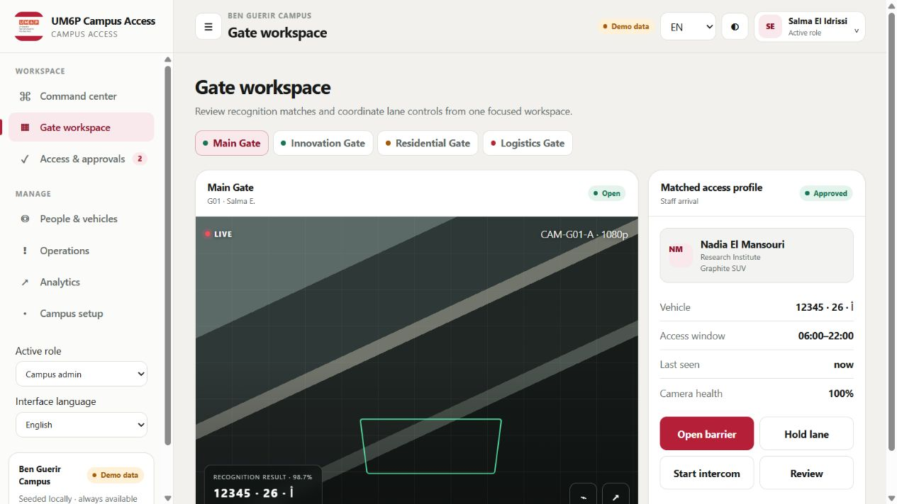
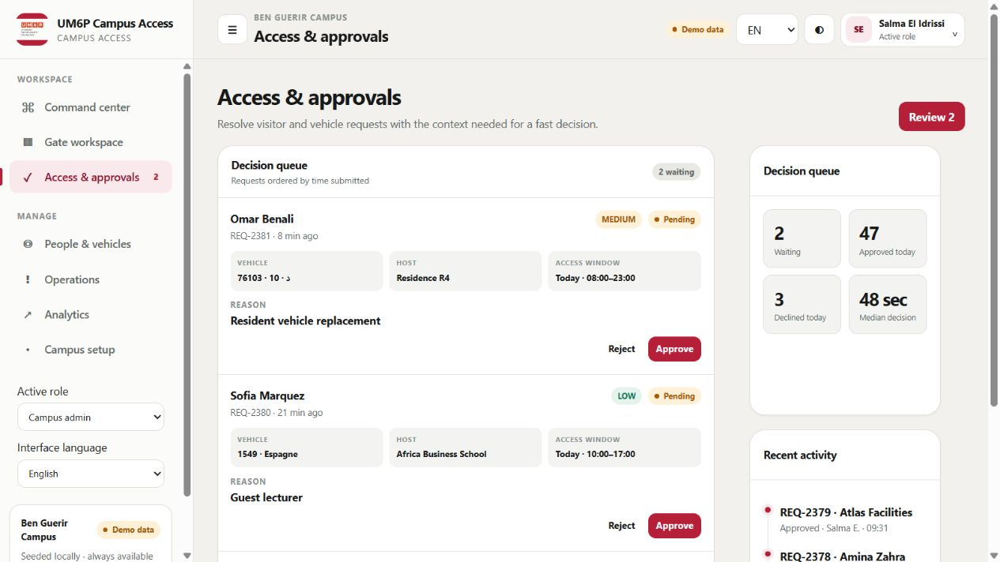
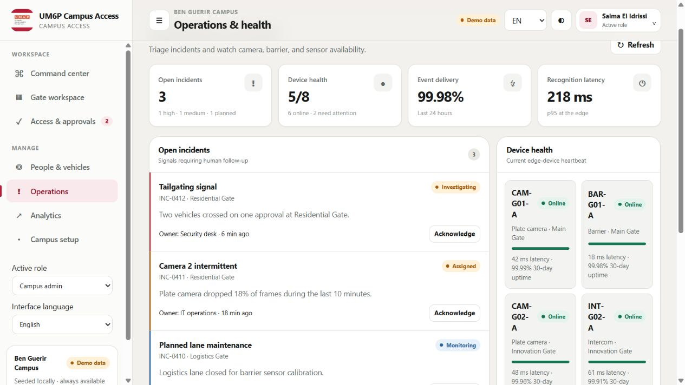
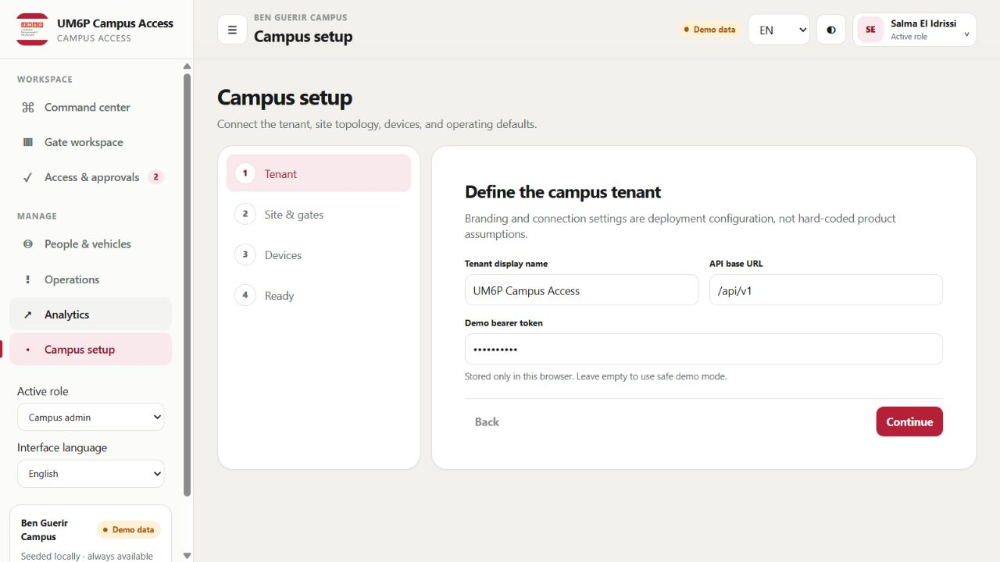
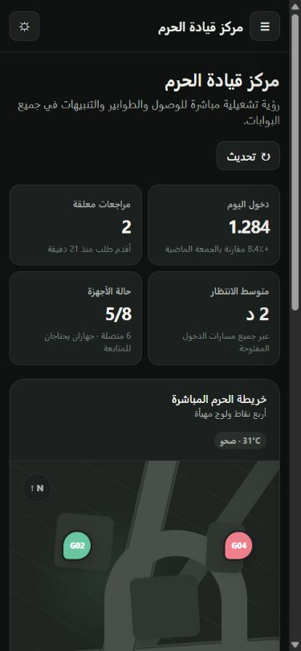

# Product media

← [Platform documentation index](../README.md) · [Video package](../video/README.md)

These images are deterministic captures of the local seeded demonstration. All people, vehicles,
plate-like values, events, and operational metrics shown in the interface are synthetic. UM6P
branding is authorized for this demonstration; it does not imply a live deployment, endorsement,
or verified user research. See the [full demo-data disclosure](../video/demo-data-disclosure.md).

## Screenshot set

### Command center

Use: product overview and the opening/closing video frame. The visible **Demo data** badge is part of
the evidence boundary and must not be cropped out.

### Gate workspace

Use: explain the observation/access/actuation separation. The camera panel's `LIVE` treatment is a
fixture UI state inside a page clearly marked **Demo data**; it is not a real camera feed. The
**Open barrier** control is displayed but was not pressed, and no actuator endpoint is configured.

### Access and approvals

Use: show typed requests and bounded review actions. Every name, request, plate-like value, metric,
and activity item is synthetic.

### Operations and health

Use: explain persistent incident ownership and device-health context. Latency, uptime, delivery,
incident, and camera/barrier values are fixtures, not measured service levels or live telemetry.

### Campus setup

Use: show the white-label configuration seam. The masked demo bearer-token field represents the
prototype's browser-local demo authentication only; it is not a recommended production credential
flow. Do not replace the mask with a visible token in published media.

### Mobile Arabic/RTL

Use: demonstrate responsive behavior, Arabic localization, right-to-left layout, and dark theme.
The narrow crop does not contain the desktop source badge; label it **Synthetic demo data** whenever
it appears outside a page that already carries the disclosure.

## Regeneration and publication

Regenerate captures after intentional visual or fixture changes by following the
[deterministic recording guide](../video/recording-guide.md). Preserve a clean browser profile,
fixed viewport, seeded state, and the disclosure/source badge. Before publishing, verify that no
token, credential, notification, real name, real plate, or unrelated browser/desktop context is
visible.
