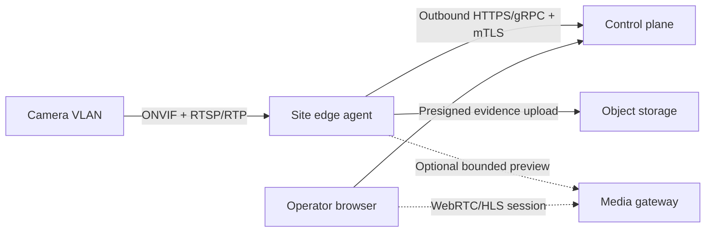
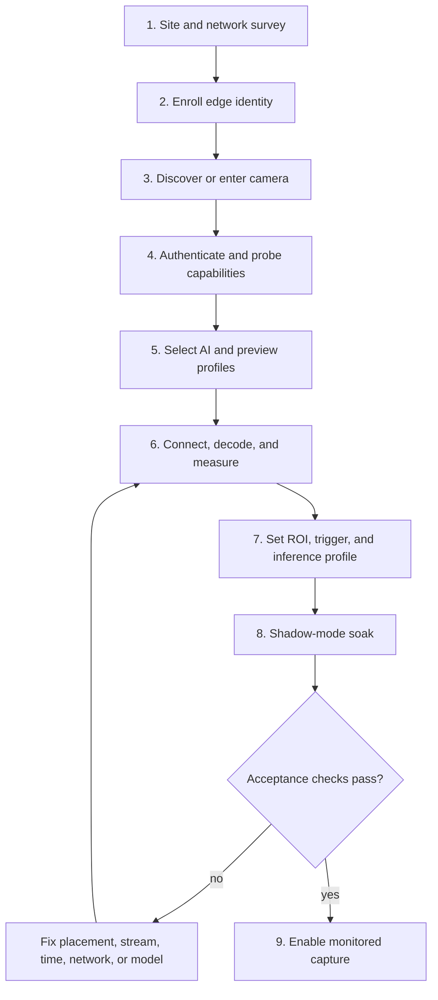
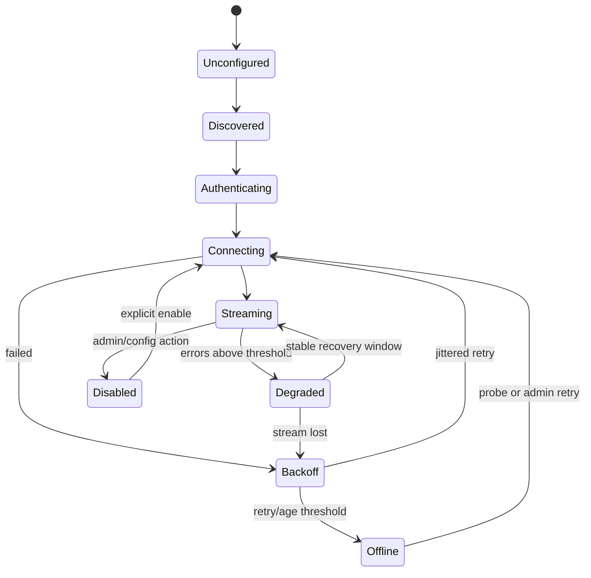

# Camera and edge onboarding

← [Platform documentation index](README.md)

## Status and goal

The repository does not yet implement an ONVIF/RTSP edge agent. This is a **target runbook** for a
pilot implementation. Its goal is to add a camera without exposing camera credentials or a private
camera network to the browser/public control plane, and without confusing “stream connected” with
“recognition calibrated.”

The repository's `scripts/simulate_gate.py` is a local integration exerciser, **not** an edge agent
or camera connector. It can send synthetic recognition or a local-image inference result through
the implemented control API without opening a barrier. Use it to rehearse the record/workflow
contract described in the
[deployment runbook](deployment-runbook.md#deterministic-end-to-end-gate-simulation); use the steps
below only when implementing and piloting real camera connectivity.

## Protocol strategy

- Prefer [ONVIF Profile T](https://www.onvif.org/profiles/profile-t/) for new camera integration:
  advanced video streaming, H.264/H.265, imaging controls, events/metadata, and optional PTZ/relay
  capabilities.
- Use [ONVIF Profile M](https://www.onvif.org/profiles/profile-m/) when camera-native analytics or
  license-plate metadata/events are available. Normalize native analytics into the same observation
  envelope as central inference; do not create a vendor-only domain model.
- Consider [ONVIF Profile G](https://www.onvif.org/profiles/profile-g/) only when retrieving edge
  recordings after an outage is a real requirement.
- Treat Profile S/manual RTSP as a compatibility fallback. ONVIF has announced
  [Profile S deprecation](https://www.onvif.org/profiles/profile-s/profile-s-deprecation-qna/), so
  new procurement should prefer Profile T and stronger transport/authentication capabilities.
- RTSP is session control; RTP carries the media. Support camera reality pragmatically, but base new
  transport behavior on [RFC 7826](https://www.rfc-editor.org/info/rfc7826/).

ONVIF conformance is capability-based. Probe the actual device/firmware instead of assuming every
optional feature exists because a product page mentions a profile.

## Required topology

The edge agent normally runs on the same routed network as the cameras. WS-Discovery multicast often
does not cross VLANs/subnets; deploy an agent per network zone or provide an explicit camera address
allowlist rather than opening broad routing.

## Credentials and network boundary

Before enrollment:

- create a camera account dedicated to the edge agent with only the capabilities it needs;
- use a secret store or encrypted edge credential store;
- retain a central credential **reference**, not a password or credential-bearing RTSP URI;
- restrict outbound agent destinations to the control plane/object/media endpoints;
- block direct public access to camera HTTP/RTSP ports;
- document camera VLAN, agent interface, DNS/NTP, and firewall ownership;
- confirm who can rotate the camera and edge identities;
- make vendor-cloud/P2P features an explicit decision rather than leaving defaults enabled.

Never put a password in a screenshot, API example, log, health detail, support bundle, or
credential-bearing RTSP URI.

## Onboarding workflow

### 1. Site and network survey

Record:

- organization, site, gate, lane/direction, camera role;
- vendor, model, firmware, serial/ONVIF endpoint reference;
- camera and agent network zones, addresses, routes, DNS, NTP;
- expected traffic direction/speed, day/night lighting, weather, headlight glare;
- installation height, angle, focal length/zoom, and minimum plate pixel size;
- trigger source: loop, beam, gate controller, Profile M event, or software ROI;
- acceptable WAN outage and evidence retention/spool budget;
- whether live operator preview is required.

Do not use IP address as device identity: DHCP/addressing can change. Retain the ONVIF endpoint UUID,
serial, and an internal opaque camera ID.

### 2. Enroll the edge agent

The target enrollment flow uses a short-lived single-use token to exchange for a device certificate.
Confirm:

- device ID, site, software version, certificate fingerprint, and expiry;
- heartbeat visible with no camera configured;
- desired and applied configuration versions match;
- disk capacity/watermarks and spool directory are healthy;
- agent clock is synchronized and reports drift;
- outbound reconnection works after a brief network interruption.

### 3. Discover or enter the camera

Bind WS-Discovery to approved interfaces and a short discovery window. Display discovered devices for
an administrator to select; do not auto-enroll every camera on the LAN. Provide explicit host/service
URL entry when multicast is unavailable.

Deduplicate by internal ID plus ONVIF endpoint reference/serial. Record changed IP separately.

### 4. Authenticate and probe capabilities

Use ONVIF device/media services to retrieve:

- manufacturer, model, firmware, serial, endpoint reference;
- profile tokens, codec, resolution, frame rate, bitrate, and stream URI;
- imaging controls and current time/time-zone information;
- event and metadata support;
- snapshot URI if supported;
- PTZ, input, relay, recording capabilities only when required.

Persist a capability snapshot and probe time. Do not persist a credential-bearing stream URI.

### 5. Select stream profiles

Keep preview and inference needs independent:

| Use | Typical choice | Reason |
| --- | --- | --- |
| AI capture | Enough plate pixels with bounded FPS/bitrate | Accuracy without forwarding continuous high-bitrate video |
| Operator preview | Substream suitable for WebRTC/HLS | Low start time and bandwidth |
| Incident clip | Main stream only on explicit trigger | Preserve context without constant central recording |

H.264 usually has the broadest decode/browser-gateway support. H.265 can reduce bandwidth but may
require additional decode/transcode support. Record the negotiated codec rather than silently
transcoding in the control API.

Prefer RTSP-over-TCP where packet loss/firewall traversal makes UDP unreliable; permit UDP on a
measured local network when it materially reduces latency. Decode through a supervised FFmpeg or
GStreamer process boundary, not inside the public API process.

### 6. Connect, decode, and measure

Run a representative connection test:

- stream URI obtained and redacted in output;
- first-frame and reconnect times;
- codec, actual resolution/FPS, keyframe interval;
- decode errors, packet loss, jitter, and frame timestamp behavior;
- continuous run across at least the planned pilot shift/window;
- automatic reconnect after camera restart, agent restart, and brief network loss;
- no unbounded memory/process growth.

### 7. Capture and inference profile

The existing pipeline begins with vehicle detection, which fits overview images. A fixed ANPR camera
may tightly frame the plate, making vehicle-first inference redundant or harmful. Assign a versioned
profile per camera:

| Profile | Entry stage | Suitable input |
| --- | --- | --- |
| `overview-cascade-v1` | Vehicle → plate → characters | Wide context/overview camera |
| `plate-roi-v1` | Plate → characters in calibrated ROI | Fixed lane ANPR view |
| `camera-metadata-v1` | Normalize Profile M/vendor metadata | Camera-native analytics, with source labeled |

Also define:

- normalized ROI/polygon and travel direction;
- trigger/debounce and burst length;
- sample/frame quality selection;
- confidence thresholds as inference configuration, not authorization policy;
- maximum frames/bytes and queue priority;
- model bundle/profile version and rollback version.

Use daytime, night, glare, rain/dust, motorcycles, close-following vehicles, and representative plate
formats during calibration. The three repository demo images are a smoke path, not a camera
acceptance dataset.

### 8. Shadow-mode soak

In shadow mode:

- no platform action opens or closes a barrier;
- attendants follow the existing procedure;
- the platform records synthetic/test or appropriately authorized pilot evidence;
- compare passage grouping, plate candidates, latency, duplicates, missed triggers, and device health;
- label ground truth and corrections separately from model output;
- review false confidence and failure clusters, not just aggregate accuracy.

Promotion criteria belong to the [pilot plan](pilot-rollout.md#stage-2-shadow-mode).

### 9. Acceptance record

Record an onboarding result containing:

- camera/agent/config/profile/model versions;
- capability snapshot and test time;
- network/clock/stream measurements;
- calibrated ROI and representative frames with synthetic/authorized evidence label;
- known limitations and fallback procedure;
- approver and next review date.

## Camera connection state machine

Expose the state, last transition, last good frame, failure class, retry time, and desired/applied
config versions. Avoid a single ambiguous red/green dot.

## Offline spool policy

The edge agent uses local SQLite for metadata and a filesystem/object cache for media. Define:

- maximum bytes and maximum age;
- high/critical watermarks;
- priority: decisions/event metadata before optional media;
- drop order for low-priority preview/capture data;
- checksums and atomic file publication;
- retry with backoff/jitter;
- idempotency key and source sequence;
- observable oldest item and dropped counts.

During an outage, last-known-good capture configuration remains active. Central-only inference is
delayed until reconnect. No missing response becomes an allow decision.

## Onboarding acceptance checklist

- [ ] Camera identity is stable across address changes.
- [ ] Credentials are scoped, stored at edge, rotated, and absent from logs/API.
- [ ] Profile/capabilities are captured; Profile T preferred for new integration.
- [ ] AI and preview streams are selected independently.
- [ ] Clock drift and NTP state are visible.
- [ ] Restart/reconnect tests pass without duplicate passages or unbounded resources.
- [ ] ROI/trigger/inference profile is versioned and rollbackable.
- [ ] Day/night/adverse-condition samples have been evaluated.
- [ ] WAN outage and spool watermark behavior have been rehearsed.
- [ ] Shadow mode is enabled; no autonomous command path exists.
- [ ] Operator fallback and technician ownership are documented.

## Related documents

- [Architecture](architecture.md#camera-and-media-boundary)
- [Data model and workflows](data-and-workflows.md#camera-and-configuration-desired-state)
- [Security and privacy](security-and-privacy.md#camera-and-edge-secrets)
- [Deployment runbook](deployment-runbook.md)
- [Troubleshooting](troubleshooting.md#camera-or-edge-agent-is-offline)
