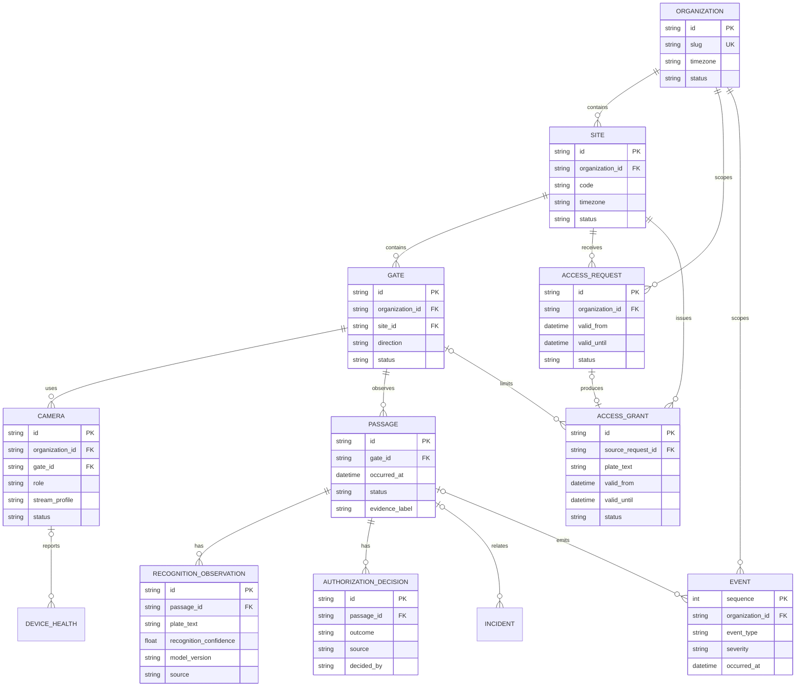
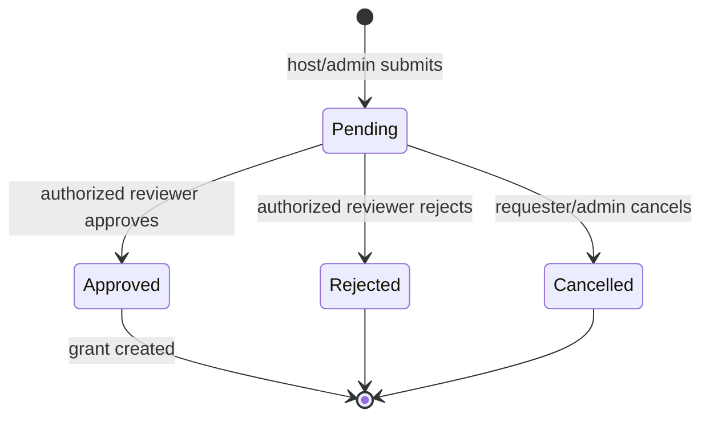
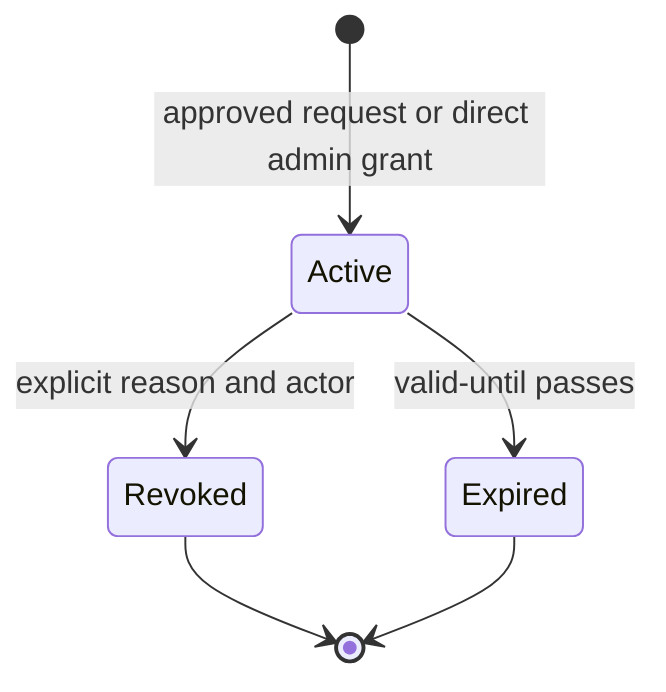
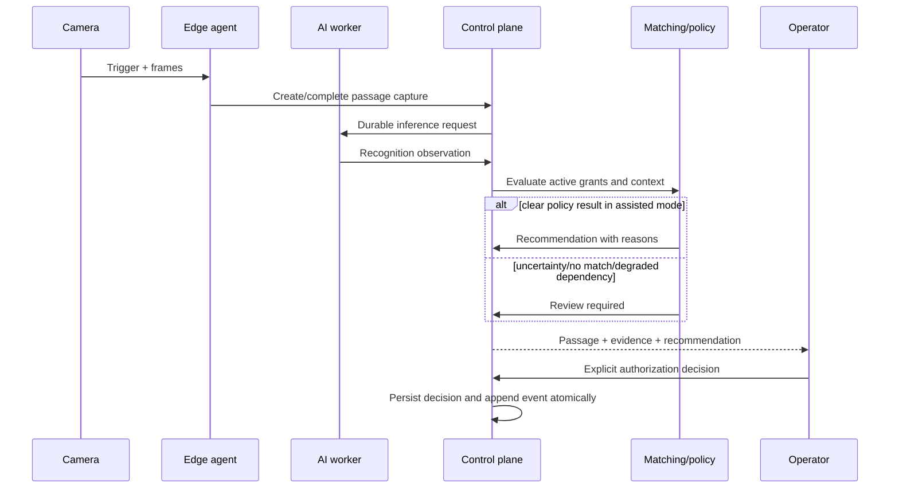
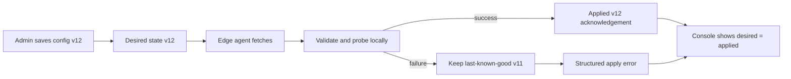

# Data model and workflows

← [Platform documentation index](README.md)

## Domain vocabulary

| Term | Meaning | Key boundary |
| --- | --- | --- |
| Organization | Tenant and primary data/permission boundary | A principal is scoped here unless platform admin |
| Site | Physical campus/network/time-zone boundary | Hosts edge agents and gates |
| Gate | Operational lane/entrance boundary | Has direction, status, queue estimate, and devices |
| Camera | Managed video source assigned to a gate and role | Metadata centrally; credentials at edge |
| Access request | Host/admin request for future access | Pending until approved/rejected/cancelled |
| Access grant | Time-bounded permission for a subject/plate | May be revoked; is not proof of arrival |
| Passage | One correlated vehicle movement through a gate | Groups evidence and decisions |
| Recognition observation | Model/camera claim about visible plate text | Evidence, never authority by itself |
| Authorization decision | Allow/review/deny/no-match outcome with reason and actor/source | Separate from a future actuator command |
| Event | Append-oriented notification of a domain/operational change | Cursor-readable integration/read-model input |
| Incident | Assigned operational investigation | Can reference gate and passage |
| Device health | Time-stamped device status sample | Must retain freshness and source |

## Core relationship model

The diagram represents the prototype schema and the durable concepts expected in the target
architecture.



## Data invariants

1. A recognition observation cannot imply an authorization decision.
2. Every tenant-scoped row and query carries an organization ID, including high-volume events.
3. A gate and camera must belong to the same organization/site as their passage.
4. Access validity uses an explicit start/end time and the site's display time zone; persisted
   instants are UTC.
5. An approved request creates or references a grant; rejecting/cancelling does not.
6. Revocation is recorded with actor, time, and reason rather than deleting the grant.
7. Recognition carries source, model version, confidence fields, format validity, time, and evidence
   label.
8. An authorization decision carries outcome, reason, source, actor, and time.
9. Events are appended and cursor-read; changes to source records do not rewrite event history.
10. Synthetic/composite records retain an evidence label through exports and screenshots.

SQLite foreign keys enforce part of this in the prototype. Cross-table organization/site equality
also requires repository/service checks; PostgreSQL can strengthen it with composite keys and row
policies.

## Access-request lifecycle



An update cannot silently move a request between states. Decision endpoints own state transitions
and require a reason where policy calls for one.

## Grant lifecycle



“Expired” may be projected from time rather than updated by a scheduled job, but API output must be
consistent and searchable.

## Arrival and decision workflow



No physical command is shown because it is out of the initial scope. If introduced later, it is a
new expiring command after the decision and has its own acknowledgement.

## Passage correlation

One vehicle may produce multiple frames or camera observations. A passage groups them so the UI
does not create one “arrival” per frame.

Recommended correlation inputs:

- edge agent ID, boot ID, and monotonic sequence;
- site/gate/lane and direction;
- trigger ID and capture timestamps;
- bounded time window;
- optional loop/intercom metadata;
- temporal plate consensus and image-quality score.

The target uniqueness key for ingest is `capture_id` or `(agent_id, boot_id, sequence)`. Worker
retries upsert one observation identity instead of creating duplicate operational decisions.

## Event envelope

Internal asynchronous messages should use a versioned envelope independent of HTTP models:

```json
{
  "schema_version": 1,
  "message_id": "01J...",
  "trace_id": "4f...",
  "organization_id": "org-atlas",
  "site_id": "site-atlas-main",
  "gate_id": "gate-atlas-north",
  "camera_id": "camera-atlas-north-anpr",
  "passage_id": "passage-...",
  "capture_id": "capture-...",
  "occurred_at": "2026-08-23T08:30:01Z",
  "sent_at": "2026-08-23T08:30:02Z",
  "source_sequence": 1842,
  "payload": {}
}
```

The broker is at-least-once. Consumers keep an inbox/deduplication record; producers use a database
outbox so committed state and published events cannot drift silently.

## Camera and configuration desired state

Camera configuration is centrally desired but edge-applied:



This avoids conflicting two-way edits. Commands have expiry; events are immutable; desired
configuration is versioned and acknowledged.

## Media data

Do not store images or video clips as SQLite/PostgreSQL blobs. Store:

- object key and bucket/container;
- organization/site prefix;
- content type and byte size;
- SHA-256 digest;
- capture/evidence type;
- created and expiry timestamps;
- source and model/annotation version;
- optional redaction/retention class.

The browser receives short-lived signed URLs or a media session, never storage credentials.

## Search and indexing

For event volume beyond the prototype:

- index `(organization_id, occurred_at DESC, id DESC)` for passages;
- index active grants by organization, normalized plate, status, and validity end;
- use cursor pagination rather than deep offsets;
- partition passages/events by time only after measurements justify it;
- move high-frequency health samples to a metrics/time-series store while retaining latest state in
  the control plane;
- normalize plate text for matching but retain display/original candidates separately.

## Retention categories

Retention is an operational product decision, not a certification exercise.

| Category | Default pilot posture | Reason |
| --- | --- | --- |
| Configuration and topology | Retain while active plus change history | Required to reproduce behavior |
| Access requests/grants | Bounded business window plus review period | Support planned access and disputes |
| Passage/decision metadata | Pilot-defined bounded period | Operational analysis and incident context |
| Recognition images/crops | Shorter than metadata unless incident-pinned | Higher sensitivity and storage cost |
| Incident evidence | Explicit owner and expiry | Avoid indefinite “just in case” storage |
| Device metrics | Aggregate/downsample over time | Raw samples become high volume |
| Reference-scenario data | Regenerable; never mixed into live tenant storage | Determinism, not operational record |

Exact values belong in each deployment's configuration and backup capacity plan. See
[Security and privacy](security-and-privacy.md#data-minimization-and-retention).

## Related documents

- [Architecture](architecture.md)
- [API overview](api-overview.md)
- [Camera and edge onboarding](camera-edge-onboarding.md)
- [Backup and restore](backup-restore.md)
- [ADR-0006: event delivery](adrs/0006-at-least-once-events.md)
