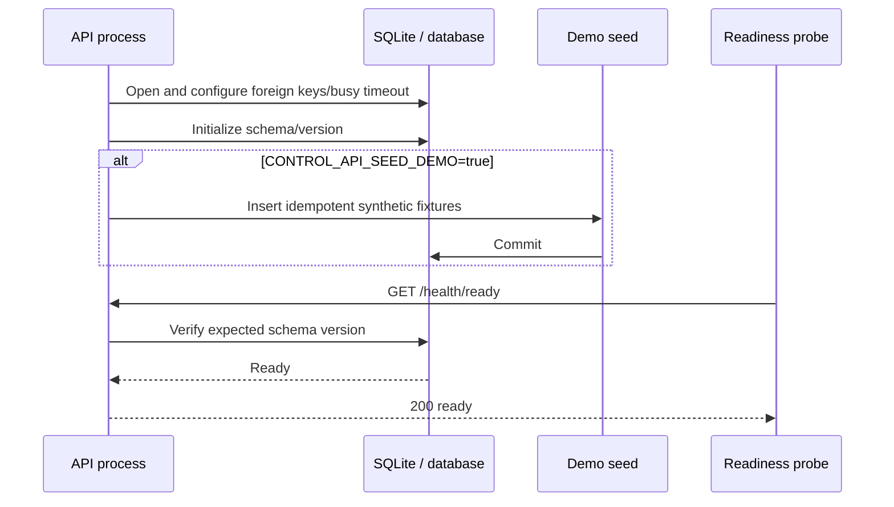
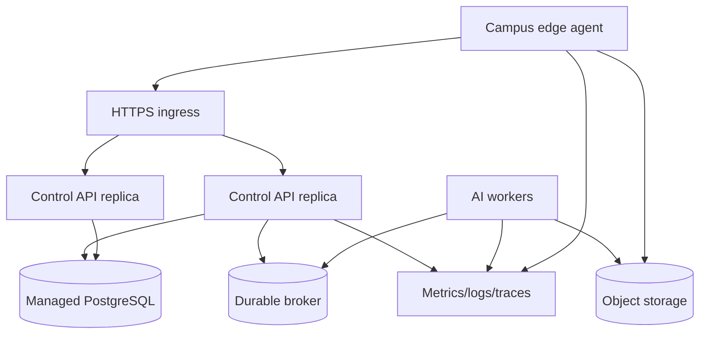

# Deployment and service runbook

← [Platform documentation index](README.md)

## Supported deployment levels

| Level | Purpose | Persistence/integration | Claim boundary |
| --- | --- | --- | --- |
| Local case-study demo | Reviewer walkthrough and deterministic video | SQLite + seeded data; console served by API | **Implemented prototype** |
| Isolated integration environment | API/UI tests and role/tenant exercises | SQLite, synthetic data only | **Prototype** |
| Shadow pilot | Observe selected real gates without actuation | PostgreSQL/object storage/broker + edge/worker | **Target** |
| Assisted production | Operator-supported decisions under defined SLOs | Hardened target topology | **Target; requires pilot evidence** |

Do not deploy the named demo bearer tokens or seeded identities as internet-facing authentication.

## Local prototype quick start

### Prerequisites

- Python 3.12
- `uv`
- a modern browser
- Node.js 18 or newer only when running console JavaScript tests/the integrated quality gate

### Recommended bootstrap

The repository-owned bootstrap prepares both locked Python environments, installs the configured
pre-commit and pre-push hooks, and runs the platform and model-manifest doctors. From the repository
root, use the script for your shell:

```powershell
.\scripts\bootstrap_platform.ps1
```

```bash
bash scripts/bootstrap_platform.sh
```

Both scripts require `uv` and locate or install a managed Python 3.12 interpreter. Use
`-NoHooks`/`-SkipChecks` in PowerShell, or `--no-hooks`/`--skip-checks` in Bash, only for an
intentional automation step that runs the omitted work separately. Pass an explicit interpreter as
`-PythonPath C:\path\to\python.exe` or `--python /path/to/python`.

The bootstrap is idempotent with respect to dependency synchronization and hook installation. It
does not start a long-running service or erase a database. During bootstrap, both scripts scope
`uv`'s cache to the repository-local `.uv-cache` directory. On a restricted host, use the same
`UV_CACHE_DIR` for standalone `uv` commands or rerun the bootstrap instead of depending on a
non-writable global cache.

### Start the prototype

After bootstrap, start the same-origin API and console with the repository-owned launcher:

```powershell
.\scripts\run_platform.ps1
```

```bash
bash scripts/run_platform.sh
```

The launcher synchronizes the locked control-API environment, loads the root `.env` when present,
binds to the safe `127.0.0.1:8000` default, and serves the console from the API process. Start flags:

| Purpose | PowerShell | Bash |
| --- | --- | --- |
| Explicit local host/port | `-BindAddress 127.0.0.1 -ListenPort 8100` | `--host 127.0.0.1 --port 8100` |
| Skip the locked sync after a known-good bootstrap | `-NoSync` | `--no-sync` |
| Ignore a present root `.env` | `-NoEnvFile` | `--no-env-file` |

Copy `.env.example` to `.env` only when persistent local overrides are useful; the launcher works
without it. Do not commit `.env`. Binding `0.0.0.0` broadens network exposure and is not a routine
local-demo setting.

The equivalent manual command, useful for debugging the launcher itself, is:

```powershell
$env:CONTROL_API_DB_PATH = ".runtime/campus-control.sqlite3"
$env:CONTROL_API_SEED_DEMO = "true"
uv run --project services/control_api --frozen python -m control_api
```

For a manual environment setup when hooks/checks are deliberately managed elsewhere, run
`uv sync --locked` and `uv sync --project services/control_api --locked` before the start command.

Open:

- console: <http://127.0.0.1:8000/>
- OpenAPI UI: <http://127.0.0.1:8000/docs>
- liveness: <http://127.0.0.1:8000/health/live>
- readiness: <http://127.0.0.1:8000/health/ready>

The API serves `web/console` at `/` when that directory and `index.html` exist. Set
`CAMPUS_CONSOLE_DIR` to an alternative built/static console directory.

### Verify startup

```powershell
Invoke-RestMethod http://127.0.0.1:8000/health/live
Invoke-RestMethod http://127.0.0.1:8000/health/ready
Invoke-RestMethod http://127.0.0.1:8000/api/v1/meta
Invoke-RestMethod http://127.0.0.1:8000/api/v1/demo-identities
uv run --frozen python scripts/platform_doctor.py --api-url http://127.0.0.1:8000
```

Expected readiness includes `status: ready`, service name, and the current SQLite schema version.
The platform doctor additionally checks Python/SQLite versions, runtime-directory writability, and
the expected API, console, worker, documentation, and model-manifest files. Add `--json` for
machine-readable CI/support output. Without `--api-url`, it remains a local checkout check and does
not require a running service.

## Configuration

| Variable | Service default without `.env`/Compose | Purpose |
| --- | --- | --- |
| `CONTROL_API_DB_PATH` | `.runtime/campus-control.sqlite3` under repository root | SQLite database file |
| `CONTROL_API_SEED_DEMO` | `true` | Insert deterministic synthetic/composite fixtures idempotently |
| `CAMPUS_CONSOLE_DIR` | `web/console` | Static console directory mounted at `/` |
| `CONTROL_API_CORS_ORIGINS` | Local development origins | Comma-separated origins when console is served separately |
| `CONTROL_API_HOST` | `127.0.0.1` | Bind address; use `0.0.0.0` only inside an intentionally exposed container/network boundary |
| `CONTROL_API_PORT` | `8000` | TCP port, validated in the range 1–65535 |

Use an absolute persistent database path in a container/pilot. Invalid boolean values fail startup
rather than silently changing seed behavior.

When API and console share one origin, CORS is unnecessary. If separated, use exact approved HTTPS
origins. The prototype allows credentials `false`; production authentication design determines the
appropriate cookie/header policy.

## Quality gates

The preferred cross-project gate is the repository-owned deterministic orchestrator:

```powershell
uv run --frozen python scripts/platform_quality.py check
```

It checks both locks; root and control-API format/lint/type/test boundaries; model-manifest and
platform diagnostics; dependency-free console syntax/contracts; and PowerShell/Bash syntax when the
shells are available. Useful options are `--scope root|service|frontend|scripts`, `--sync`,
`--keep-going`, and `--require-script-shells`. CI and the pre-push hook use this integrated boundary.

For the focused control-API gate, keep the nested project authoritative through the orchestrator:

```powershell
uv run --frozen python scripts/platform_quality.py check --scope service
```

When diagnosing an individual backend tool, change into the nested project before running its exact
commands:

```powershell
Push-Location services/control_api
$RunId = [guid]::NewGuid().ToString("N")
try {
  uv run --project . --frozen ruff format --check control_api ../../tests/platform_backend
  uv run --project . --frozen ruff check control_api ../../tests/platform_backend
  uv run --project . --frozen mypy control_api ../../tests/platform_backend
  uv run --project . --frozen pytest -q --basetemp "../../.runtime/pytest-control-api-$RunId"
}
finally {
  Pop-Location
}
```

For a focused console diagnosis:

```powershell
npm --prefix web/console run check
```

Also run the repository's existing recognition quality suite when shared inference contracts or
integration adapters change. The integrated gate runs the fast recognition suite; a successful
UI/API test is not a substitute for the separately marked real-model smoke when model boundaries
change.

## Local container run

This path requires Docker Engine/Desktop with the Compose v2 plugin. The Compose service is named
**`control-api`**:

```powershell
docker compose build control-api
docker compose up -d control-api
docker compose ps control-api
docker compose logs --tail 100 control-api
```

Open <http://127.0.0.1:8000/> and verify readiness as in the local run. `CONTROL_API_PORT` in a root
`.env` changes the host-side port; the container continues to listen on 8000. The service stores its
SQLite database in the named `platform-data` volume, runs as a non-root user with a read-only root
filesystem, drops Linux capabilities, and exposes only the control API plus static console. It does
not contain the computer-vision models or inference worker.

Stop it without deleting the data volume:

```powershell
docker compose stop control-api
```

Use `docker compose down` only when intentionally stopping the entire Compose project. Do not add
`--volumes`/`-v` to routine shutdown: that deletes the named SQLite volume. Back up or deliberately
discard that state before any volume-removal operation. Keep `CONTROL_API_SEED_DEMO` enabled only
for an isolated demonstration.

## Deterministic end-to-end gate simulation

With the API running against a disposable, demo-seeded database, the repository simulator creates a
passage, attaches a recognition observation, evaluates the active grants, records a separate
authorization decision, and prints the final records as JSON:

```powershell
uv run --frozen python scripts/simulate_gate.py --plate 12345-A-6
```

The default plate matches a seeded active grant. Useful bounded variants are:

```powershell
# Below the automatic-decision threshold: review_required
uv run --frozen python scripts/simulate_gate.py --plate 12345-A-6 --confidence 0.55

# Invalid format: review_required
uv run --frozen python scripts/simulate_gate.py --plate TEST-PLATE --invalid-format

# Ingest evidence but deliberately skip the authorization step
uv run --frozen python scripts/simulate_gate.py --plate 12345-A-6 --no-decision

# Exercise the repository's real local recognition pipeline, if model assets are installed
uv run --frozen python scripts/simulate_gate.py --image images/Car1.jpg
```

Replace the final image path with another existing, intentionally publishable test image if needed.
Run `uv run --frozen python scripts/simulate_gate.py --help` to see organization, site, gate, camera,
token, and threshold overrides. The script labels created evidence as synthetic composite. It writes
API records but has no barrier/actuator route; run it only against the intended disposable database
and never describe an `allowed` decision as a physical gate opening.

## Startup and readiness sequence



Liveness proves the process can answer. Readiness proves the expected persistence schema is
available. A future worker has separate readiness that includes model load and warm-up.

## Local shutdown and restart

Use normal process termination (`Ctrl+C`) and wait for exit. Do not delete the database to “restart.”
On restart:

1. liveness may answer before external routing resumes;
2. lifespan initializes/checks schema;
3. deterministic seed is idempotent when enabled;
4. readiness becomes the routing signal.

If a schema change is incompatible, stop and follow its migration/rollback note; do not point an old
binary at a migrated database without compatibility evidence.

## Pilot topology

This is **target**, not the local prototype:



Promotion from SQLite requires the repository adapter, migrations, tenant-isolation tests,
PostgreSQL backups, and measured load. Do not place one SQLite file on shared network storage or run
multiple writer replicas against it.

## Deployment preflight

- [ ] Change, image/package identity, and rollback version are recorded.
- [ ] Dependency locks and relevant test suites pass.
- [ ] Database migration is reviewed and restore-tested.
- [ ] Seed/demo mode is off for a live environment.
- [ ] Demo tokens are unavailable in a live environment.
- [ ] CORS/ingress hosts and certificates are correct.
- [ ] Secret references resolve without appearing in output.
- [ ] Storage capacity, queue limits, and edge spool watermarks are configured.
- [ ] Health probes and dashboards exist for API, database, worker, edge, and camera.
- [ ] Shift/site owner knows the window and fallback procedure.
- [ ] No physical actuation is introduced outside its separately approved pilot stage.

## Deployment sequence

1. Capture current application/config/schema/model versions and health baseline.
2. Verify a recent backup and, for risky migrations, complete a restore rehearsal.
3. Apply backward-compatible database migration first.
4. Deploy control API with readiness excluded from traffic until healthy.
5. Deploy workers by canary/model profile; warm before consuming normal priority.
6. Deploy desired edge configuration to one canary site/gate and wait for applied acknowledgement.
7. Verify one synthetic/test passage end to end.
8. Expand gradually while comparing errors, queue age, latency, and recognition distribution.
9. Record deployment result, known deviations, and next review time.

## Smoke verification

For the prototype:

- health live/ready return 200;
- `/api/v1/meta` states demo data/evidence policy;
- demo identities list is reachable;
- each demo role can access `/api/v1/session` with its token;
- non-platform role cannot switch to another organization via `X-Organization-ID`;
- dashboard/topology/events return only the token's organization;
- console loads and visibly labels source mode;
- create/cancel request works as host; decide works only with the permitted role;
- recognition ingest does not itself create an allow decision.

For a target pilot, additionally verify edge heartbeat/config versions, camera frame freshness, object
upload, inference job/result, event cursor, offline retry, and no actuation path in shadow mode.

## Rollback

Rollback is triggered by tenant isolation failure, unsafe command behavior, migration/data integrity
failure, sustained queue/latency breach, widespread crash loop, or operator inability to distinguish
stale state.

1. Stop promotion and remove the new version from traffic.
2. Disable new commands/ingest that could worsen state; retain read access when safe.
3. Return application/config/model assignment to the recorded known-good version.
4. Roll database backward only through the migration's tested method. Prefer forward repair when a
   destructive reverse migration would lose valid writes.
5. Verify health plus one bounded end-to-end synthetic path.
6. Reconcile queued/offline messages idempotently; do not replay expired commands.
7. Record the incident and evidence needed for correction.

## Operational targets

These are **provisional pilot objectives, not measured achievements**:

- explicit stale/degraded indication within two missed heartbeat intervals;
- no duplicate decision for retried capture/message identity;
- capture-to-visible observation p95 agreed from the measured network/model baseline;
- queue/spool capacity covers the declared outage window at measured event rate;
- restore meets the pilot's declared RPO/RTO;
- zero autonomous physical commands in shadow mode.

Do not publish an SLO until its measurement source and on-call response exist.

## Handoff record

Every pilot deployment should leave:

- version/config/model/schema identities;
- topology and enabled gate/camera list;
- health/dashboard and log locations;
- known limitations and active incidents;
- backup time and restore instructions;
- rollback version/owner;
- operator/manual fallback;
- next review or expiry date.

## Related documents

- [Backup and restore](backup-restore.md)
- [Troubleshooting](troubleshooting.md)
- [Camera and edge onboarding](camera-edge-onboarding.md)
- [Pilot and rollout](pilot-rollout.md)
- [Security and privacy](security-and-privacy.md)
