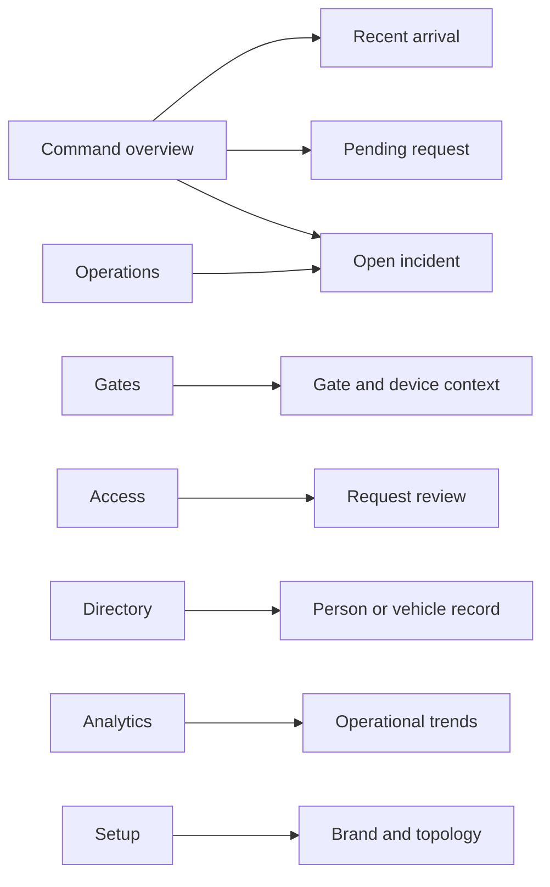

# Design evolution

← [Platform documentation index](README.md)

This document makes the path from problem framing to prototype decisions inspectable. Research and
feedback entries marked **illustrative/composite** are design exercises, not verified interviews or
usability sessions. See [Research and evidence](research-and-evidence.md#methodology-disclosure).

## First sketch: recognition result at one gate

The earliest concept put the computer-vision result at the center:

```text
┌──────────────────────────────────────────────┐
│ Camera image                                │
│                                              │
│              [ 12345 · أ · 26 ]             │
│                                              │
├──────────────────────────────────────────────┤
│ Confidence 98.7%          [Open] [Reject]    │
└──────────────────────────────────────────────┘
```

It was useful for proving inference but weak as an operations product. It did not explain whether a
grant existed, which gate produced the event, whether the camera was healthy, who made the decision,
or what to do when recognition was uncertain.

## Second sketch: all information on one dashboard

The next concept combined gates, arrivals, requests, directory, incidents, devices, and charts into
one page:

```text
┌──────────┬──────────────────────────────┬──────────────┐
│ 4 gates  │ live arrivals               │ incidents    │
│ map      │ requests + directory        │ device grid  │
│          │ decision controls            │ analytics    │
└──────────┴──────────────────────────────┴──────────────┘
```

This improved context but gave every task equal visual weight. The resulting design response was a
stable navigation model with a command view for active work and dedicated gates, access, directory,
operations, analytics, and setup views.

## Current prototype information architecture



The console preserves a clear source state: **Live API** when every resource loads, **Partial API**
(internally `hybrid`) when some load, and **Demo data** when none load. Demo fallback supports
deterministic review and recording; it must never be presented as a live campus feed.

## Rejected alternatives

| Alternative | Why it was attractive | Why it was rejected | Decision |
| --- | --- | --- | --- |
| Recognition-only gate screen | Fastest extension of existing model demo | Conflates observation with authority and lacks operational context | Keep inference as evidence inside a passage review |
| One dense “single pane” | Everything appears visible | High cognitive load; routine and administrative tasks compete | Stable task-based navigation plus command overview |
| Cloud service pulls camera RTSP directly | Fewer deployable components | Private LAN reachability, credential exposure, and WAN instability | Site edge agent owns camera connectivity |
| Stream continuous video to central inference | Simple mental model | High bandwidth/cost and poor outage behavior | Edge selects bounded frames/bursts; live preview is separate |
| Open barrier above a confidence threshold | Appears fast and automated | Confidence is not authorization; stale grants and tailgating remain | Explicit policy/operator decision before any command |
| One app/database per gate | Strong local independence | Fragmented operations and duplicated configuration | Organization/site control plane with gate-scoped state |
| Microservices for every domain | Signals theoretical scale | Operational complexity before requirements are known | Modular control plane plus separately scaled edge/AI workers |
| Hide demo data when API is partial | Avoids mixed sources | Makes prototype fragile and blank during backend work | Visible Live API / Partial API / Demo data source state |

## Finding-to-decision traceability

| Finding or constraint | Evidence label | Decision | Where represented |
| --- | --- | --- | --- |
| A plate result alone cannot explain entry authority | Engineering analysis; repeated composite theme | Separate recognition observation, grant, authorization decision, and gate command | [Data workflow](data-and-workflows.md#arrival-and-decision-workflow), [ADR-0002](adrs/0002-separate-recognition-authorization.md) |
| Gate staff work under exception-driven time pressure | Illustrative/composite | Prioritize arrivals, pending requests, and incidents in command view | [Operator guide](guides/operator.md), console prototype |
| Camera LANs and credentials should not be exposed centrally | Threat/failure analysis | Outbound site edge agent owns ONVIF/RTSP | [Camera onboarding](camera-edge-onboarding.md), [ADR-0004](adrs/0004-edge-owned-camera-connectivity.md) |
| Existing model pipeline is typed and UI-independent | Repository evidence | Reuse it behind a worker boundary rather than rewriting it in the API | [Architecture](architecture.md#recognition-core-reuse) |
| One model bundle serializes a request | Repository evidence | Scale isolated worker processes after memory/latency measurement | [Architecture](architecture.md#central-ai-worker) |
| Fixed ANPR cameras may already frame a plate | Engineering analysis | Support camera-specific pipeline profiles instead of requiring vehicle-first inference | [Camera onboarding](camera-edge-onboarding.md#7-capture-and-inference-profile) |
| Operators need to know whether data is current | Illustrative/composite and failure analysis | Expose live/partial/demo and device freshness explicitly | [Troubleshooting](troubleshooting.md#console-shows-demo-data-or-partial-api), [ADR-0005](adrs/0005-white-label-deterministic-demo.md) |
| Campus work may cross EN/FR/AR | Illustrative/composite design coverage | Localized messages, RTL layout, tenant time zone | [Admin guide](guides/admin.md#branding-language-and-time-zone) |
| Prototype should be easy to review without ML startup | Repository/product constraint | Deterministic console fixtures and independent control API | [Video recording guide](video/recording-guide.md) |
| SQLite cannot support a replicated production control plane | Engineering constraint | SQLite for local proof; PostgreSQL before multi-replica production | [ADR-0003](adrs/0003-sqlite-prototype-postgresql-production.md) |

## Illustrative prototype feedback and change log

All entries in this section are **illustrative/composite walkthrough notes** with design timestamps.
They are not actual participant quotations or sessions.

| Illustrative date | Composite walkthrough note | Design change | Status |
| --- | --- | --- | --- |
| 2026-07-21 | “I can see the plate, but not why the system recommends review.” | Add grant/decision reason and retain confidence as supporting evidence | Reflected in data/API design |
| 2026-07-22 | “A degraded camera looks like a quiet gate.” | Add device health, status, latency, and freshness to operations context | Reflected in prototype data model |
| 2026-07-23 | “I cannot tell if these records are live.” | Add explicit Live API / Partial API / Demo data behavior | Implemented in console API boundary |
| 2026-07-24 | “The overview is useful, but setup changes should not share the same task space.” | Separate command, operational, analytic, and setup routes | Implemented in console route model |
| 2026-07-25 | “A French or Arabic shift should not inherit English-only labels or left-to-right assumptions.” | Add EN/FR/AR locale selection and RTL behavior | Implemented in console core/configuration |
| 2026-07-28 | “Do not replay an old open command after a network outage.” | Give future physical commands an expiry, correlation ID, acknowledgement, and no offline replay | Target edge contract |
| 2026-07-29 | “A demo name and plate could be mistaken for real data in a screenshot.” | Add stable synthetic-data disclosure and recording checklist | Implemented in documentation/video package |

## Prototype change policy

When real pilot feedback becomes available:

1. add a separately labeled, dated evidence record;
2. preserve whether the input was observed behavior, participant statement, metric, or inference;
3. link the evidence to a decision or explicitly record “no change” and why;
4. update or supersede the relevant ADR when architecture changes;
5. never relabel the composite entries above as real research.

## Next design questions

- Which exception reasons are most actionable at each gate?
- Does the gate attendant need a dedicated reduced interface separate from the command center?
- Which decisions require two-person confirmation?
- What is the minimum useful evidence under limited bandwidth?
- When should multiple frames be grouped into one passage rather than separate arrivals?
- How should international and partially recognized plates be represented without false precision?
- Which analytics improve staffing decisions without encouraging surveillance-by-default?

These questions are part of the [pilot learning plan](pilot-rollout.md#learning-plan).

## Related documents

- [Research and evidence](research-and-evidence.md)
- [Product overview](product-overview.md)
- [Architecture](architecture.md)
- [Architecture decisions](adrs/README.md)
- [Video storyboard](video/storyboard.md)
