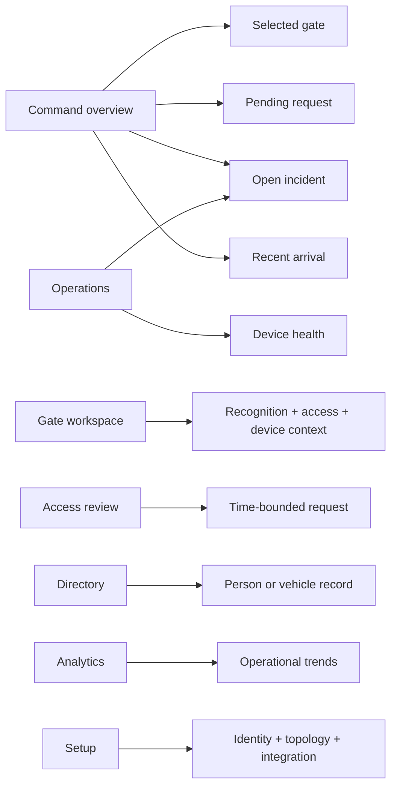

# Design evolution

← [Platform documentation index](README.md)

Campus Access evolved from an image-focused model interface into a multi-gate operations system.
This document traces the decisions that produced that shift and links each important choice to
runnable code or a documented deployment seam. The underlying scenario and operational lenses are
described in [Workflow analysis and design inputs](research-and-evidence.md).

## Iteration 1: recognition result at one gate

The earliest concept put the computer-vision result at the center:

```text
┌──────────────────────────────────────────────┐
│ Camera image                                 │
│                                              │
│              [ 12345 · أ · 26 ]             │
│                                              │
├──────────────────────────────────────────────┤
│ Confidence 98.7%          [Open] [Reject]    │
└──────────────────────────────────────────────┘
```

This proved that the model could produce a plate candidate, but it left the operational questions
unanswered: which gate produced the event, whether an access window matched, whether the camera was
healthy, who owned the decision, and what should happen when confidence was low.

**Decision:** keep inference as one typed input to a passage workflow rather than make the model
screen the product boundary.

## Iteration 2: every concern on one dashboard

The next concept combined gates, arrivals, requests, directory, incidents, devices, and charts on a
single page:

```text
┌──────────┬──────────────────────────────┬──────────────┐
│ 6 gates  │ live arrivals               │ incidents    │
│ map      │ requests + directory        │ device grid  │
│          │ decision controls            │ analytics    │
└──────────┴──────────────────────────────┴──────────────┘
```

The additional context solved the recognition-only problem but gave active lane work, historical
analysis, incident response, and configuration equal visual weight.

**Decision:** establish a stable task model: command, gates, access, directory, operations,
analytics, and setup.

## Iteration 3: map-led command and focused workspaces

The implemented console uses a six-gate campus illustration as an operational index. Its footprint
is rendered locally from the project author's annotated campus boundary and gate reference; the
interactive gate markers remain a separate data layer. A selected gate exposes queue, wait,
throughput, status, and a direct route into the gate workspace. Recent arrivals and the attention
strip keep active exceptions in view without turning the map into a reporting dashboard.


The gate workspace then narrows the task to one lane: camera context, plate candidate, confidence,
matching access profile, time window, device health, and bounded controls.


**Decision:** overview pages answer “where does attention belong?”; workspaces answer “what action is
needed now?”

## Implemented information architecture



The same structure works across desktop, mobile, English, French, and Arabic/RTL layouts. Source and
freshness state remain visible at shell level so every workspace shares the same operating context.

## Rejected alternatives

| Alternative | Why it was attractive | Why it was rejected | Resulting decision |
| --- | --- | --- | --- |
| Recognition-only gate screen | Fastest extension of the existing model | Omits request context, device state, ownership, and exceptions | Place inference evidence inside the passage/gate workflow |
| One dense “single pane” | Everything appears immediately visible | Routine work, incidents, analysis, and setup compete for attention | Task-based navigation plus a concise command overview |
| Central service pulls camera RTSP directly | Fewer components to explain | Private-LAN reachability, credential exposure, and WAN instability | Outbound site edge agent owns camera connectivity |
| Continuous video to central inference | Straightforward processing model | High bandwidth/cost and poor outage behavior | Edge selects bounded frames; live preview remains a separate media path |
| Open the barrier above a confidence threshold | Appears fast and automated | Confidence does not include request state, time window, device state, or tailgating context | Require an explicit access decision before a command |
| One application/database per gate | Strong local independence | Fragments campus operations and duplicates configuration | Organization/site control plane with gate-scoped state |
| Microservice for every domain | Signals theoretical scale | Adds operational complexity before scale boundaries are measured | Modular control plane with separable edge and AI workers |
| Hide local-reference data whenever one API call succeeds | Avoids mixed sources | Produces incomplete or blank screens during integration work | Visible connected/partial/reference source state at resource level |
| Hard-code the reference campus | Reduces setup work | Couples product logic, presentation, and one topology | Replaceable tenant configuration and data-driven gates |

## Finding-to-decision traceability

| Finding or constraint | Basis | Decision | Where represented |
| --- | --- | --- | --- |
| A plate candidate cannot explain the whole gate decision | Domain decomposition | Separate recognition observation, grant match, access decision, and command | [Data workflow](data-and-workflows.md#arrival-and-decision-workflow), [ADR-0002](adrs/0002-separate-recognition-authorization.md) |
| Gate work is exception-driven and time-sensitive | Operational-role model | Prioritize arrivals, pending requests, incidents, and degraded gates | [Operator guide](guides/operator.md), command center, gate workspace |
| Camera networks and credentials belong at the site edge | Threat and failure analysis | Outbound edge agent owns ONVIF/RTSP connectivity | [Camera onboarding](camera-edge-onboarding.md), [ADR-0004](adrs/0004-edge-owned-camera-connectivity.md) |
| The recognition pipeline is typed and UI-independent | Repository review | Reuse it behind a worker contract instead of rewriting it in the API | [Architecture](architecture.md#recognition-core-reuse) |
| A model bundle serializes one request at a time | Repository review | Scale isolated workers after memory and latency measurement | [Architecture](architecture.md#central-ai-worker) |
| Fixed ANPR cameras may already frame the plate | Pipeline and camera analysis | Support camera-specific pipeline profiles instead of requiring vehicle-first inference | [Camera onboarding](camera-edge-onboarding.md#7-capture-and-inference-profile) |
| Operators must know whether context is current | Failure-mode analysis | Expose source state, heartbeat, latency, and freshness | [Troubleshooting](troubleshooting.md#console-shows-reference-scenario-or-partial-api), [ADR-0005](adrs/0005-white-label-deterministic-demo.md) |
| Campus shifts may cross English, French, and Arabic | Operational-role model | Localized messages, Arabic RTL layout, and tenant time zone | [Administrator guide](guides/admin.md#branding-language-and-time-zone), console core tests |
| Review should not require ML startup | Delivery constraint | Keep the console reference state and control API independently runnable | [Video recording guide](video/recording-guide.md), console fixtures |
| SQLite is not a replicated control-plane store | Storage constraint | Use SQLite for local review; move multi-replica deployments to PostgreSQL | [ADR-0003](adrs/0003-sqlite-prototype-postgresql-production.md) |
| Networks retry and reorder work | Distributed-systems constraint | Stable capture IDs, event cursors, expiry, and idempotent consumers | [ADR-0006](adrs/0006-at-least-once-events.md) |

## Design critiques and resulting changes

| Critique | Change | Current result |
| --- | --- | --- |
| The recognition result does not explain why review is required | Add access context, time window, match state, and reason beside confidence | Reflected in gate workspace and API models |
| A degraded camera can look like a quiet gate | Add device health, status, latency, freshness, and a command-center attention state | Reflected in operations and command views |
| Records can look current when the API is incomplete | Make connected, partial, reference, and offline states persistent shell context | Implemented in the console data boundary |
| Setup changes compete with active operations | Separate setup from command, gate, access, directory, operations, and analytics routes | Implemented in the route model |
| Left-to-right assumptions break Arabic operation | Use shared translations, logical CSS properties, locale-aware formatting, and RTL navigation | Implemented and covered by console tests/media |
| A network retry can repeat an old command | Require future edge commands to carry correlation, expiry, acknowledgement, and idempotency | Captured in the edge/event architecture |
| A campus-specific identity can leak into business rules | Put logo, names, palette, locale, API, organization, and site in configuration | Implemented in the tenant configuration seam |

## Site-integration questions

The application core deliberately leaves these questions to a real site rollout:

- Which exception reasons are most actionable at each gate and shift?
- Does a gate attendant need an even smaller lane-only interface?
- Which physical actions require two-person confirmation?
- What evidence remains useful under constrained bandwidth?
- When should several frames become one passage rather than several arrivals?
- Which pipeline profile best fits each camera angle and plate scale?
- How should international and partial plate candidates be represented?
- Which operational analytics improve staffing and maintenance decisions?

The [pilot plan](pilot-rollout.md#learning-plan) turns these questions into staged measurements.

## Related documents

- [Workflow analysis and design inputs](research-and-evidence.md)
- [Product overview](product-overview.md)
- [Architecture](architecture.md)
- [Architecture decision records](adrs/README.md)
- [Video storyboard](video/storyboard.md)
