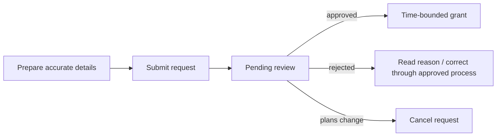

# Host guide

← [Platform documentation index](../README.md)

## Purpose

Hosts and coordinators submit time-bounded access requests for visitors or service vehicles and
track their status. Submitting a request is not approval; the designated access role makes the
decision and any grant remains limited by its time/site/gate scope.

## Before creating a request

Confirm:

- visitor/subject display name needed for the gate workflow;
- visit purpose;
- correct campus/site and preferred gate if known;
- arrival start/end window with enough margin, but not an all-day/default wildcard;
- plate text if known and appropriate for the visit;
- whether plans may change and who can be contacted through the approved channel.

Do not put identity-document numbers, passwords, health details, or unrelated personal information
into the purpose/notes field.

## Create a request

1. Open **Access requests** and choose **New request**.
2. Select the site and optional preferred gate.
3. Enter the subject name and kind, such as visitor vehicle or service vehicle.
4. Enter a concise purpose.
5. Enter the plate exactly as supplied; leave it empty rather than guessing.
6. Set a valid start and end in the displayed site time zone.
7. Review the summary, then submit.
8. Retain the request ID and wait for `approved` or `rejected` status.

## Status meanings

| Status | Meaning | Host action |
| --- | --- | --- |
| Pending | Submitted, no decision yet | Avoid duplicates; follow normal escalation if time-critical |
| Approved | A grant should exist for the approved scope/window | Confirm details before sending arrival instructions |
| Rejected | Reviewer did not approve | Read bounded reason; create a corrected request only when appropriate |
| Cancelled | Request intentionally withdrawn | Create a new request if plans resume; do not reuse cancelled ID |

## Change of plan

- Before decision: update permitted details or cancel, according to the UI/API state rules.
- After approval: contact the access owner if changing plate, person, site/gate, or validity window;
  do not assume an edited message changes the grant.
- If the visitor will not come: cancel/revoke through the approved workflow.
- If arrival is outside the window: expect manual review; do not ask the visitor to pressure gate
  staff to bypass the policy.

## Plate-entry guidance

- Preserve the supplied characters and country/format context.
- Avoid adding decorative separators unless the field format requests them.
- For an unknown/rental/replacement vehicle, leave the plate empty and explain the legitimate
  circumstance concisely.
- A plate identifies a vehicle registration display, not a person's identity.

## Visitor communication

Send only information the visitor needs:

- authorized date/time and campus/gate;
- request/reference ID if local process uses it;
- expected manual verification or intercom step;
- contact/escalation channel;
- instruction to follow gate/safety staff.

Do not send screenshots containing other visitors, gates, incidents, analytics, or credentials.

## If the visitor is waiting

1. Verify the request ID/status/window in your own session.
2. Correct an obvious request error through the workflow; do not create several duplicates.
3. Contact the designated access desk using the approved channel.
4. Allow the operator/attendant to make the current decision; the host view cannot override physical
   safety or evidence quality.

## Demo warning

When the console source says **Demo data** or **Partial API**, synthetic fixtures may be visible. Do
not use those records for a real visitor workflow. The demo host token is a local review tool, not a
real identity credential.

## Related documents

- [Operator guide](operator.md)
- [Administrator guide](admin.md)
- [API access-request example](../api-overview.md#example-create-and-decide-an-access-request)
- [Security and privacy](../security-and-privacy.md#data-minimization-and-retention)
