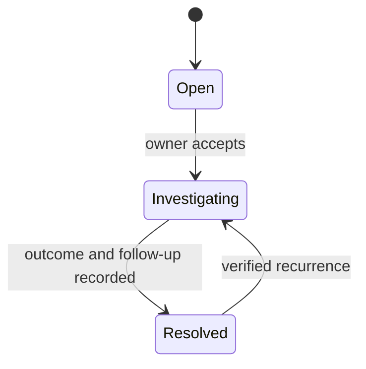

# Operator guide

← [Platform documentation index](../README.md)

## Purpose and scope

This guide covers the command-center/security-operator workflow. The current console is a
**prototype** using Live API, Partial API, or deterministic Reference scenario resources. Follow
local site safety and gate procedures first; the platform does not replace an attendant's physical
verification, intercom, barrier safety loop, or emergency process.

## Start-of-shift checklist

1. Confirm the tenant, campus, locale, time zone, and signed-in role.
2. Read the source indicator:
   - **Live API**: every expected resource loaded from the API.
   - **Partial API**: only some resources loaded; identify which panels may use reference records.
   - **Reference scenario**: no operational resource is live. Its internal source-state key is
     `demo`; never use reference records for real access decisions.
   - **Offline fallback**: the browser is offline and the deterministic reference snapshot is active.
3. Review gate states and queue estimates.
4. Review degraded/offline devices and the age of their last health signal.
5. Review open critical/warning incidents and current owner.
6. Confirm the local manual fallback and escalation contact for each active gate.

## Triage order

Use this order unless local emergency procedure overrides it:

1. physical safety/emergency at a gate;
2. critical incident or suspicious passage;
3. vehicle currently waiting for a decision;
4. growing queue or degraded gate;
5. pending future access request;
6. routine administration/analytics.

## Review an arrival

Open the passage/arrival and read the evidence in this order:

1. gate, direction, and occurred time;
2. data freshness and camera/edge health;
3. recognition status (`recognized`, `uncertain`, or `unreadable`);
4. plate candidate and detection/recognition confidence;
5. model/source/evidence label;
6. matching active grant, time window, subject, and gate/site scope;
7. prior decisions and any linked incident;
8. policy recommendation and reason.

Confidence is supporting evidence, not permission. Check that the grant is active now and applies to
the site/gate. When evidence is stale, contradictory, unreadable, or missing, use review/manual
procedure rather than guessing.

## Record a decision

| Outcome | Use when | Required record |
| --- | --- | --- |
| Allow | Identity/access context is confirmed under current policy | Reason/source and linked grant where applicable |
| Review required | More information or another actor is needed | Specific missing/contradictory element and owner |
| Deny | Current policy clearly denies access | Bounded reason; follow site communication procedure |
| No match | No eligible grant/record matches | Search method and next safe step |

The API records the authenticated actor and time. Do not use a colleague's session or put sensitive
free-form details into the reason field.

If a future deployment integrates barrier commands, confirming a decision and executing a physical
command remain separate actions. Confirm the lane is safe and never replay an old command.

## Handle a pending request

1. Confirm requester/host and subject name.
2. Check site, preferred gate, start/end time, purpose, and plate if used.
3. Check for overlap, duplicate, revoked subject/vehicle, or an incident note.
4. Approve or reject through the decision action, with a reason.
5. Verify that an approved request produced the expected grant and event.

Hosts can submit; only roles with access-decision permission approve/reject.

## Create and manage an incident

Create an incident when work must persist beyond one immediate decision, for example:

- possible tailgating;
- recurring camera packet loss;
- repeated unmatched arrivals;
- incorrect topology/policy affecting a gate;
- evidence or service outage requiring follow-up.

Include gate/passage link, concise title, severity, observable facts, and current owner. Do not turn an
uncertain model result into an accusation. Use status:

## Degraded operation

### Camera degraded/offline

- Confirm which role/stream is affected and last good frame/heartbeat.
- Check whether another approved camera/attendant procedure covers the lane.
- Do not interpret absence of detections as absence of vehicles.
- Create/assign an incident if the fault exceeds the shift threshold.

### API or WAN unavailable

- Treat the console as stale/unavailable even if cached layout remains visible.
- Use the documented local manual procedure.
- Record decisions in the approved offline log if one exists; reconcile after service recovery with
  clear original timestamps/source.
- Never use deterministic demo records as offline operational records.

### AI worker delayed

- Check queue age and passage status.
- Do not repeatedly resubmit the same capture; idempotent retry belongs to the service.
- Use manual plate/identity verification when the waiting-time threshold is reached.

## End-of-shift handoff

- unresolved critical/warning incidents and owners;
- gates/devices in degraded, offline, maintenance, or disabled state;
- queue/backlog and oldest pending passage/request;
- temporary manual procedures in effect;
- configuration/model change or rollback during the shift;
- any offline records that still require reconciliation.

Do not export or message screenshots with real evidence unless the approved incident workflow
requires it.

## Quick “do / do not”

| Do | Do not |
| --- | --- |
| Verify source freshness and grant window | Approve from confidence alone |
| Record a concise reason and owner | Put passwords or unnecessary personal details in notes |
| Follow manual fallback when dependencies are stale | Treat no response/no detection as allow |
| Link incidents to gate/passage | Duplicate an arrival for every retry/frame |
| Escalate physical safety first | Assume a delivered future command was executed |

## Related documents

- [Host guide](host.md)
- [Administrator guide](admin.md)
- [Troubleshooting](../troubleshooting.md)
- [Security and privacy](../security-and-privacy.md)
- [Data workflows](../data-and-workflows.md#arrival-and-decision-workflow)
