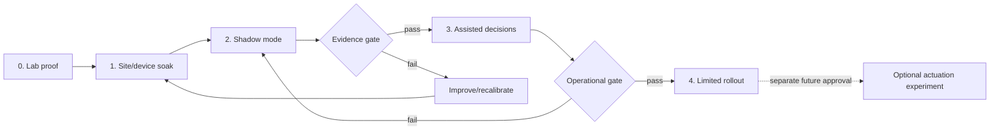

# Pilot and rollout plan

← [Platform documentation index](README.md)

## Purpose

The pilot converts assumptions and composite design artifacts into real, consented operational
evidence. It begins with lab and shadow observation, not barrier automation. Promotion is based on
measured safety, usefulness, accuracy, latency, degraded behavior, and operability.

## Scope assumptions

Initial scope should be deliberately small:

- one organization and one site;
- one primary gate plus an optional comparison gate;
- known camera/firmware models;
- selected-frame capture, not continuous central recording;
- central inference with explicit manual fallback;
- operator and host workflows;
- no automatic physical command during shadow mode;
- bounded evidence retention and named operational owners.

## Stage plan

### Stage 0: lab proof

Exit criteria:

- deterministic API/console and tests pass;
- model artifacts/contracts and real-model smoke pass;
- organization isolation tests pass;
- passage → recognition → decision → event workflow is reproducible;
- backup/restore rehearsal passes;
- synthetic demo disclosure is visible;
- no physical command path exists.

### Stage 1: site and device soak

Use a test/non-operational stream where possible. Exit criteria:

- edge identity/config lifecycle works;
- camera reconnect, restart, day/night, and clock checks pass;
- measured FPS/bitrate/packet loss/first-frame and spool growth are within declared capacity;
- no credential appears centrally or in logs;
- desired/applied config and last-known-good rollback work;
- manual gate procedure remains unchanged.

Follow [Camera and edge onboarding](camera-edge-onboarding.md).

### Stage 2: shadow mode

The platform observes and proposes; existing staff/process remains authoritative.

Collect only approved pilot data and record:

- trigger/passage completeness and duplicate rate;
- plate candidates, corrections, unreadable reasons, and format classes;
- day/night/weather/gate strata;
- capture-to-observation and UI-visible latency;
- eligible grant match and exception reason;
- operator task time/usability on simulated or approved cases;
- camera/edge/worker/API availability and stale-state visibility;
- WAN outage/spool/reconnect behavior.

No operator should be evaluated on model performance. Avoid using the pilot to make disciplinary
claims about individuals.

### Stage 3: assisted decisions

Only after shadow criteria pass:

- selected operators use the passage context during real workflow;
- every recommendation retains reason and evidence source/freshness;
- manual fallback and intercom remain available;
- policy scope is narrow and reversible;
- an on-call/incident owner is present during agreed windows;
- daily review covers incorrect recommendations and near misses.

“Assisted” still does not mean an AI confidence score opens the barrier.

### Stage 4: limited rollout

Expand one dimension at a time: shift, gate, camera profile, or user group. Do not simultaneously
change model, camera placement, policy, and workflow; the team must be able to attribute outcomes and
rollback.

Physical actuation, if ever considered, is a separately approved experiment with safety engineering,
expiring commands, controller acknowledgement, manual override, and emergency procedure.

## Pilot success measures

The table provides **provisional starting targets, not achieved metrics**. Pilot owners must confirm
them against baseline and operational consequence before launch.

| Measure | Provisional acceptance target | Source |
| --- | --- | --- |
| Organization isolation | 100% automated cross-tenant negative tests pass | API/integration tests |
| Passage duplicates | < 0.5% after idempotent correlation, with every duplicate reviewed | Passage audit sample |
| Silent stale state | 0 cases; stale/degraded visibly indicated | Failure drills + UI review |
| Capture-to-visible observation | p95 ≤ 2.5 s for selected-frame central inference | Distributed trace |
| Offline spool | Covers declared outage window without critical metadata loss | Edge outage drill |
| Recognition exact match | Gate/condition-specific threshold set from baseline; no global invented claim | Labeled shadow set |
| Review explanation | ≥ 90% sampled review cases identify actionable reason/source | Structured review |
| Host request completeness | ≥ 95% contain required site/window/subject fields by schema; plate optional | API records |
| Restore | Meets declared RPO/RTO in rehearsal | Restore record |
| Unsafe/autonomous commands in shadow | 0; command integration absent | Architecture/config inspection |

Accuracy metrics should include false match, missed plate, unreadable, format validity, and confidence
calibration by gate/condition—not only exact-match accuracy on successful detections.

## Learning plan

| Question | Method | Decision it informs |
| --- | --- | --- |
| Which arrivals create real queue delay? | Baseline observation and event timestamps | Trigger/workflow priority |
| Which exception reasons are actionable? | Task-based operator sessions and outcome coding | Review UI and policy explanations |
| Is host plate entry useful and accurate? | Request completeness/correction analysis | Required/optional fields |
| Does one view fit command center and gate booth? | Contextual usability on both form factors | Separate attendant surface |
| What camera conditions dominate errors? | Stratified labeled shadow set | Camera placement/profile/model work |
| How long can WAN/inference be unavailable? | Site process workshop and outage drill | Central versus optional edge inference |
| Which evidence must be retained, and for how long? | Incident workflow/capacity review | Retention classes |

Real findings must be stored separately from the composite artifacts in
[Research and evidence](research-and-evidence.md).

## Rollout responsibilities

| Activity | Product owner | Campus operations | IT/camera | Engineering/on-call | Site safety owner |
| --- | --- | --- | --- | --- | --- |
| Scope and success criteria | Accountable | Consulted | Consulted | Consulted | Consulted |
| Current/manual procedure | Consulted | Responsible | Consulted | Informed | Accountable |
| Camera/edge installation | Informed | Consulted | Accountable/responsible | Consulted | Consulted |
| API/worker deployment | Informed | Informed | Consulted | Accountable/responsible | Informed |
| Shadow evidence review | Accountable | Responsible | Consulted | Consulted | Consulted |
| Incident response | Consulted | Responsible | Responsible by fault | Responsible by fault | Accountable for physical safety |
| Promotion/rollback | Accountable | Required approval | Required approval | Required approval | Required approval if physical impact |

Replace role titles with named owners before launch. “Everyone” is not an incident owner.

## Risk register

| Risk | Early signal | Mitigation | Rollback trigger |
| --- | --- | --- | --- |
| Recognition confidently wrong | False-match cluster or poor calibration | Review-only, thresholds as evidence, better camera/data/model | Any unsafe reliance or threshold breach |
| Camera/network instability | Frame gaps, reconnects, clock drift | Edge backoff/spool, placement/network remediation | Sustained unobservable gate |
| Operator cannot see stale state | Reference scenario / Partial API / Live API ambiguity in task test | Prominent source/freshness and drills | Any decision made from mislabeled stale/reference data |
| Cross-tenant leak | Negative test or log/media mismatch | Tenant context + repository/RLS + signed URL scope | Any confirmed cross-tenant access |
| Queue/worker overload | Queue age/backlog and p95 rise | Sampling/admission/priority/scale | Waiting time exceeds manual threshold |
| Host data incomplete | High correction/call rate | Typed fields, guidance, optional plate | Workflow creates more delay than baseline |
| Evidence retention grows uncontrolled | Storage slope/watermark alerts | Bounded policy and deletion verification | Capacity/sensitivity threshold breach |
| Staff workarounds emerge | Duplicate requests/screenshots/offline notes | Simplify workflow and clarify ownership | Unsafe or untraceable workaround |

## Failure drills

Before assisted use, rehearse:

- camera restart and changed IP;
- edge restart and certificate/config error;
- WAN outage longer than a normal reconnect;
- worker unavailable and queue recovery;
- object storage unavailable;
- API unavailable while edge spools;
- database restore into an isolated environment;
- duplicate/out-of-order capture/event delivery;
- clock skew;
- browser showing Partial API or Reference scenario resources;
- operator handoff during an unresolved incident.

Each drill records expected/actual state, detection time, user-visible signal, data loss/duplication,
recovery time, and follow-up owner.

## Go/no-go checklist

- [ ] Scope, baseline, evidence permission, retention, and owners are approved.
- [ ] Composite/demo records are not mixed with pilot data.
- [ ] Camera/edge acceptance and outage drill pass.
- [ ] Cross-tenant, role, error, backup, and restore tests pass.
- [ ] Operators/hosts/admins completed scenario training and can identify stale/demo state.
- [ ] Manual fallback works and is staffed.
- [ ] Metrics/alerts and daily review are active.
- [ ] Rollback version/config and decision authority are known.
- [ ] Shadow mode contains no autonomous physical command.
- [ ] Open critical risks have explicit acceptance or block launch.

## Pilot closeout

Publish:

- scope and actual dates/participants in appropriately anonymized form;
- measured baseline and outcome with denominators/conditions;
- failures, exclusions, and missing data;
- usability findings distinguished from telemetry;
- model/camera/config versions;
- incidents/near misses and corrective actions;
- decision to stop, iterate, expand, or retire;
- which composite assumptions were confirmed, contradicted, or still unknown.

Do not turn a successful demo or a few screenshots into a deployment claim.

## Related documents

- [Research and evidence](research-and-evidence.md)
- [Deployment runbook](deployment-runbook.md)
- [Camera and edge onboarding](camera-edge-onboarding.md)
- [Security and privacy](security-and-privacy.md)
- [Backup and restore](backup-restore.md)
