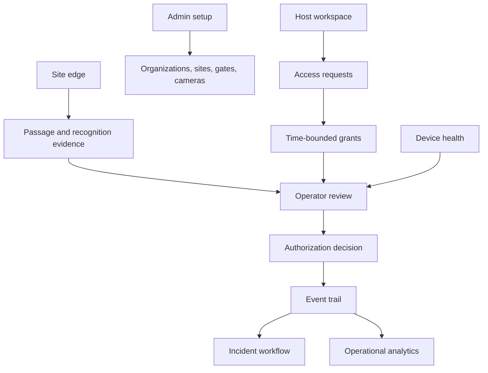

# Product overview

← [Platform documentation index](README.md)

## One-sentence product

Campus Access is a white-label operations platform that turns vehicle arrivals, invitations,
number-plate observations, gate health, and operator decisions into one traceable campus workflow.

## Problem framing

An isolated plate recognizer answers “what text might be on this image?” A campus access team has a
larger job:

- understand which gate and lane produced an arrival;
- relate a vehicle to a time-bounded grant or host request;
- distinguish a model observation from a decision to allow entry;
- keep an operator in control when confidence is low or equipment is degraded;
- see incidents and device health without switching between unrelated screens;
- recover enough context to explain what happened later.

The product therefore treats recognition as one input to an operational decision, not as an
autonomous gate controller.

The case-study origin is an **author-provided, not independently verified** account of waiting hours
at a campus gate while staff searched for an emailed vehicle authorization, followed by the author's
account of stakeholder process-mapping work. It motivates the problem but is not presented as
measured queue performance or verified research. Similar delays for other students/employees remain
an illustrative hypothesis until real discovery establishes frequency and context. See
[Research and evidence](research-and-evidence.md#author-provided-context).

## Product promise

For a campus with several gates, the platform aims to provide:

1. a shared real-time operating picture;
2. a fast exception-review path instead of hidden automation;
3. a host-to-gate invitation workflow;
4. explicit health and degraded-mode indicators;
5. an event trail that connects passage, recognition, grant, decision, and incident;
6. a deployment boundary that keeps camera credentials and RTSP traffic at the site edge.

These are product goals. Pilot targets and the method for validating them are in
[Pilot and rollout](pilot-rollout.md#pilot-success-measures).

## Users and jobs to be done

| Role | Primary job | Time pressure | What success looks like |
| --- | --- | --- | --- |
| Gate attendant | Resolve the vehicle in front of the barrier | Seconds | A clear recommendation, supporting context, and safe manual action |
| Security operator | Coordinate multiple gates and incidents | Minutes | Exceptions are prioritized and ownership is visible |
| Host or coordinator | Invite a visitor or service vehicle | Before arrival | A correct access window reaches the right site/gate with minimal back-and-forth |
| Campus administrator | Configure topology, roles, and operating policy | Days/months | Changes are scoped, reviewable, and reversible |
| IT/camera technician | Keep cameras and edge devices healthy | Minutes/hours | Fault location and reconnect state are observable without exposing credentials |
| Engineering/on-call | Operate control plane and inference services | Minutes/hours | Health, logs, queues, backups, and rollback paths are deterministic |

These roles are synthesized for design coverage, not represented as interviewed individuals. See
[Research and evidence](research-and-evidence.md#illustrative-stakeholder-set).

## Product principles

### Human authority is explicit

Recognition, authorization, and actuation are separate steps. A confidence score does not open a
barrier. The relationship is formalized in
[ADR-0002](adrs/0002-separate-recognition-authorization.md).

### Exceptions deserve the best interface

The normal path should be quick, but uncertainty, an expired grant, a device outage, or a possible
tailgating event must show the operator why review is required and which safe actions remain.

### Degraded state is a first-class state

The console may show Live API, Partial API (internally `hybrid`), or deterministic Demo data. In a
real deployment, an edge agent retains last-known-good configuration and queues bounded evidence
while disconnected.
No response is ever silently interpreted as approval.

### Physical and tenant boundaries shape the model

Organization is the isolation boundary; site is the physical/network boundary; gate is the
operational boundary; passage is the vehicle-movement boundary. See
[Data model and workflows](data-and-workflows.md#domain-vocabulary).

### Evidence is labeled honestly

Synthetic data is marked, model evidence keeps its source/version, and this case study labels
composite research. The UI and documentation should never imply that demo records are real people
or that illustrative feedback is verified field evidence.

## Scope

### Prototype scope

- white-label operations console with English, French, and Arabic/RTL presentation;
- deterministic campus, gate, arrival, request, directory, incident, device, and analytics data;
- API client capable of live, partial/hybrid, or demo snapshot behavior;
- FastAPI control-plane contracts and SQLite persistence for core campus records;
- reuse of the typed Moroccan number-plate inference pipeline as a bounded recognition component;
- documentation, operational guides, and a deterministic case-study video path.

### Target pilot scope

- one organization and one site, with one or two observed gates;
- edge connector on the camera LAN;
- event-triggered or bounded frame capture rather than continuous cloud video;
- central inference jobs with model/version traceability;
- operator review and incident workflows;
- shadow mode before any assisted physical action.

### Deliberate non-goals for the first pilot

- claiming biometric identity from a number plate;
- replacing guards, safety loops, intercoms, or emergency procedures;
- autonomous barrier actuation based only on model confidence;
- building an RTSP/WebRTC server from scratch;
- multi-region microservices before load and availability requirements justify them;
- claiming regulatory certification, production deployment, or completed field validation.

## Value hypothesis

The central hypothesis is:

> If gate teams receive a single, explainable view of arrival context, grant state, recognition
> evidence, and equipment health, then routine decisions become faster and exception handling
> becomes more consistent without removing human authority.

Supporting hypotheses are intentionally measurable:

- a host can create a valid invitation without an operator retyping it;
- an operator can identify why an arrival needs review in under a pilot-defined threshold;
- a technician can distinguish camera, edge, network, inference, and control-plane faults;
- duplicate or retried capture messages do not create duplicate operational decisions;
- the system can remain safe and observable during a bounded WAN outage.

The [pilot scorecard](pilot-rollout.md#pilot-success-measures) defines how to test these hypotheses.

## White-label positioning

UM6P is the authorized demo tenant, not a hard-coded product boundary. The console configuration
separates:

- tenant and campus identifiers;
- full and short brand names;
- logo URL, alternative text, and fallback mark;
- accent colors;
- support label;
- API base URL and refresh/timeout behavior;
- default locale, role, theme, and time zone.

Production configuration should come from a deployment-specific configuration service or generated
asset rather than editing business logic. A replacement tenant must also replace demo data,
support routes, language review, and recording disclosure. See the
[administrator guide](guides/admin.md#branding-language-and-time-zone) and
[ADR-0005](adrs/0005-white-label-deterministic-demo.md).

## Product surface

## What the repository demonstrates

The case study is intended to show engineering range rather than pretend every target component is
finished:

- typed computer-vision boundaries and model contracts;
- a control-plane data model that separates physical observations from policy decisions;
- a white-label, multilingual operations interface;
- degraded/demo behavior that can be recorded deterministically;
- deployment, camera onboarding, backup, incident, and rollout reasoning;
- explicit trade-offs captured in [ADRs](adrs/README.md).

## Related documents

- [Research and evidence](research-and-evidence.md)
- [Design evolution](design-evolution.md)
- [Architecture](architecture.md)
- [Pilot and rollout](pilot-rollout.md)
- [Video package](video/README.md)
