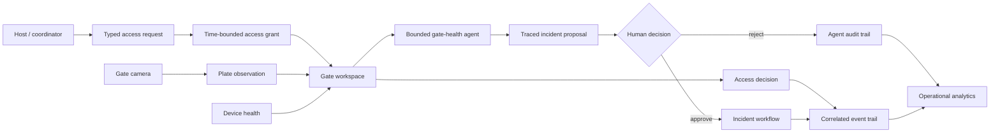

# Product overview

← [Platform documentation index](README.md)

## Product in one sentence

Campus Access coordinates vehicle arrivals, host requests, number-plate observations, gate health,
bounded agentic triage, operator decisions, and incidents across a multi-gate campus in one
traceable system.

## From fragmented handoff to shared workflow

An isolated plate recognizer answers one question: “What text might be on this image?” A campus
access team must resolve a much larger operational sequence:

- which gate and lane produced the arrival;
- whether an active request or grant matches the vehicle and time window;
- what the model observed and how confident it was;
- whether the camera, edge device, and barrier are healthy;
- who owns an exception and what action is available;
- how the resulting decision can be reconstructed later.

Campus Access brings those states together without turning model confidence into an opaque gate
command. Routine arrivals stay fast; uncertain matches, expired windows, device outages, and
incidents receive the clearest interface. The starting scenario and its design inputs are documented
in [Workflow analysis and design inputs](research-and-evidence.md).

## Operational workflow

Every step has its own record and lifecycle. A request can change before arrival; an observation can
have several candidates; a device can be degraded while a gate remains staffed; an agent proposal
can be rejected without changing operational state; and an incident can continue after the vehicle
queue has moved.

## Users and jobs to be done

| Role | Primary job | Time pressure | Product response |
| --- | --- | --- | --- |
| Gate attendant | Resolve the vehicle in front of the lane | Seconds | Focused gate view with recognition, access context, health, and bounded actions |
| Security operator | Coordinate gates and incidents | Minutes | Map-led command center plus traced, approval-gated agentic triage for device-health exceptions |
| Host or coordinator | Prepare visitor or service access | Before arrival | Validated request with site, gate, plate, purpose, and time window |
| Campus administrator | Configure topology and operating rules | Days/months | Organization-scoped setup for sites, gates, cameras, roles, and defaults |
| Camera/network technician | Keep edge devices available | Minutes/hours | Heartbeat, latency, reconnect state, and fault location without exposing camera credentials |
| Engineering/on-call | Run and recover the platform | Minutes/hours | Health endpoints, diagnostics, event context, backup/restore, and rollback procedures |

## Product principles

### Decisions remain explainable

Recognition, access policy, and physical control are separate boundaries. The gate workspace shows
the candidate, confidence, matching context, reason, actor, and current equipment state before a
command can cross into an actuator integration. See
[ADR-0002](adrs/0002-separate-recognition-authorization.md).

### Agent autonomy is explicit and bounded

The operations agent receives a typed intent and server-derived tenant/gate scope. The implemented
intent selects one fixed trajectory; the objective remains operator context rather than planning
input. It may execute three allowlisted read tools during gate-health triage, but incident creation
or investigation stays pending until an authenticated human approves or rejects the exact proposal.
Plan steps, tool observations, policy checks, decision reason, failures, and audit events are
persisted as structured state. See [Agentic AI architecture and operations](agentic-ai.md).

This boundary is independent of the planner: the current planner is deterministic, and a future
model-backed planner would inherit the same allowlist and approval policy rather than its own
authority.

### Exceptions receive the strongest interface

The command center prioritizes pending requests, queues, degraded devices, uncertain matches, and
open incidents. Each exception links to a focused workspace rather than expanding a single dense
dashboard indefinitely.

### Degraded state is part of the product

The console distinguishes connected, partial, local-reference, and offline states. Device heartbeat
and freshness remain visible so missing or stale context cannot look like a successful decision.

### Physical boundaries shape the model

Organization is the isolation boundary; site is the physical/network boundary; gate is the
operational boundary; passage is the vehicle-movement boundary. This vocabulary is shared by the
console, API, persistence layer, simulator, and documentation. See
[Data model and workflows](data-and-workflows.md#domain-vocabulary).

### Configuration stays outside domain logic

Tenant identity, locale, time zone, topology, API location, and device integration are deployment
inputs. The access workflow does not depend on one campus name, logo, camera vendor, or barrier
protocol.

## Runnable product surface

| Surface | What is implemented |
| --- | --- |
| Command center | Six configured gates on a local illustrated campus footprint, plus queues, pending reviews, recent arrivals, device health, and attention state |
| Gate workspace | Gate selection, camera treatment, recognition evidence, matched access context, lane controls, and review routing |
| Agent workspace | Retained objective context, fixed intent-selected plan/step timeline, evidence-coverage signal, tool results, risk labels, policy checks, provenance, approval/rejection controls, and audit trail |
| Access review | Role-aware request queue, approval/rejection actions, time windows, reasons, and recent activity |
| Directory | Search and filter across people, visitors, vehicles, organizations, and access assignments |
| Operations | Incident ownership, acknowledgement workflow, device heartbeat, latency, and uptime views |
| Analytics | Hourly and weekly traffic, decision mix, decision latency, and gate utilization views |
| Setup | Organization identity, API location, site/gate topology, devices, locale, theme, and time zone |
| Control API | Typed organization-scoped resources, role enforcement, OpenAPI, events, health/readiness, and SQLite persistence |
| AI boundary | Versioned JSON-safe worker contract around the typed Moroccan number-plate pipeline |
| Agentic operations | Typed `gate_health_triage` runs, allowlisted gate/health/incident tools, human-approved incident creation or investigation, idempotency, and persistent traces |
| Delivery workflow | Bootstrap/run/doctor/quality scripts, hooks, CI, container smoke path, and reproducible video build |

The command-center illustration is derived from the project author's annotated campus boundary and
gate reference. The footprint is stored locally as presentation artwork, while the six gate markers,
selection state, status, queue, wait, and throughput remain data-driven UI elements.

## Site integration boundary

The repository contains the portable application core. A campus rollout adds the parts that depend
on the site's identity, network, hardware, and availability requirements:

| Integration | Why it remains deployment-specific |
| --- | --- |
| Enterprise identity | Issuer, groups, role mapping, session policy, and key rotation belong to the organization |
| PostgreSQL and durable jobs | Replica count, RPO/RTO, throughput, and hosting model determine the topology |
| Site edge agent | Camera LAN reachability, buffering, clocks, and enrollment differ by site |
| ONVIF/RTSP cameras | Profiles, streams, credentials, regions of interest, and lighting require calibration |
| Evidence storage | Retention, object storage, signed delivery, and capacity depend on operating policy |
| Barrier adapter | Vendor protocol, interlocks, acknowledgement, expiry, and fallback require on-site validation |

The [architecture](architecture.md#implementation-status) tracks this boundary component by
component. The [pilot plan](pilot-rollout.md) stages integration through observation and assisted
operation before any broader rollout.

## Rollout success criteria

A site rollout should measure outcomes rather than inherit numbers from the reference dataset:

- request completeness and correction rate;
- time to identify why an arrival needs review;
- queue time by gate, shift, and exception reason;
- recognition quality by camera and operating condition;
- capture-to-visible latency at p50 and p95;
- device availability, reconnect time, and buffered-event recovery;
- duplicate/retry behavior across edge, worker, and control-plane boundaries;
- agent trajectory correctness, approval/rejection reasons, and duplicate-effect prevention;
- incident ownership, acknowledgement, and resolution time.

The [pilot scorecard](pilot-rollout.md#pilot-success-measures) defines collection and promotion
criteria without presenting provisional targets as achieved results.

## White-label delivery

The included UM6P-themed reference configuration exercises the same deployment seam available to any
organization:

- tenant, organization, campus, and site identifiers;
- full and short product names;
- logo URL, alternative text, fallback mark, and accent colors;
- support label;
- API base URL, refresh interval, timeout, and organization scope;
- default locale, role, theme, and time zone.

Production configuration can be generated at build time or supplied by a configuration service.
Replacing the reference tenant does not require changes to the request, passage, recognition,
decision, incident, or device-health models. See the
[administrator guide](guides/admin.md#branding-language-and-time-zone) and
[ADR-0005](adrs/0005-white-label-deterministic-demo.md).

## Engineering evidence

The product surface is backed by repository artifacts rather than presentation-only screens:

- the console consumes typed `/api/v1` resources and handles live, partial, local-reference, and
  offline states;
- organization scope and roles are enforced by the API and covered by backend tests;
- the existing inference pipeline is reused behind a worker boundary instead of duplicated inside
  the web service;
- the agent runtime exposes typed plans and tools, keeps authorization outside planning, requires a
  human decision for every mutating tool, validates provider order/risk, commits approved effects
  atomically with run completion, and is covered at tenant and retry boundaries;
- a machine-readable agent evaluation runner recreates isolated scenario databases and asserts
  healthy, degraded, offline, existing-incident, tenant-escape, and duplicate-decision behavior;
- cross-project quality runs formatting, linting, strict type checks, tests, model-manifest checks,
  and environment diagnostics;
- PowerShell, Bash, containers, backup/restore, troubleshooting, and camera onboarding are part of
  the delivery package;
- consequential trade-offs are recorded in [architecture decision records](adrs/README.md).

## Related documents

- [Workflow analysis and design inputs](research-and-evidence.md)
- [Design evolution](design-evolution.md)
- [Architecture](architecture.md)
- [Pilot and rollout](pilot-rollout.md)
- [Video package](video/README.md)
