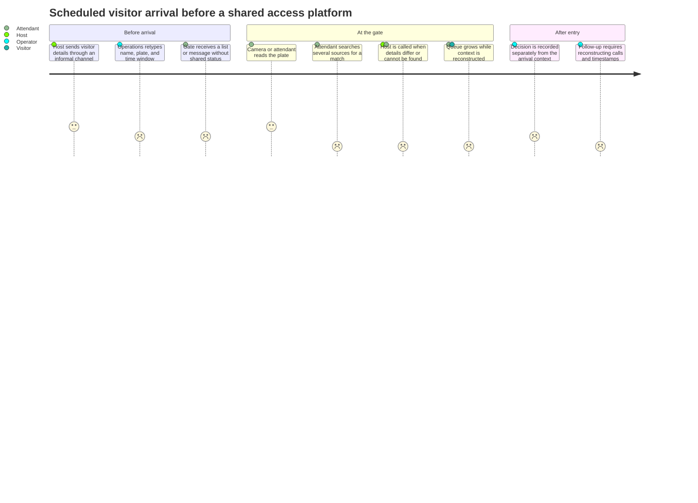

# Workflow analysis and design inputs

← [Platform documentation index](README.md)

> **Source note:** the project starts from the author's experience of a long campus-gate delay while
> staff searched for an email-based vehicle pass. The operational lenses, journey, and scenario
> critiques below were created to pressure-test the product; they are design artifacts rather than
> interview records or measured field findings. The command-center footprint is a local illustration
> derived from the project author's annotated campus boundary and six-gate reference.

## Starting scenario

A vehicle arrives with an expected reason to enter, but the supporting context lives in an informal
message or email. The gate attendant cannot see whether the request is current, which site or gate it
covers, who owns it, or what changed after it was sent. While that context is reconstructed, the
vehicle remains at the barrier and the queue grows.

The case study explores how the same failure mode affects several arrival types without claiming how
frequently it occurs:

- a student using a replacement vehicle;
- an employee with a recurring campus schedule;
- a visitor invited by a department host;
- a guest lecturer with a bounded event window;
- a service vehicle assigned to a maintenance task;
- an unmatched arrival that requires manual review.

## Design-input method

| Input | What it contributes | Repository evidence |
| --- | --- | --- |
| Existing-code review | Identifies the typed recognition pipeline, model boundaries, and reusable adapters | `src/number_plate_recognition`, model tests, manifest, CLI, and Streamlit adapter |
| Workflow decomposition | Separates request, grant, arrival, recognition, decision, incident, and device states | Control-plane schemas, repositories, API routes, and data/workflow documentation |
| Operational-role modeling | Tests what each role needs to see, change, and hand off | Console navigation, role-aware actions, user guides, and seeded scenarios |
| Failure-mode analysis | Exposes stale data, retries, network loss, device faults, and ambiguous ownership | Source-state UI, events, diagnostics, troubleshooting, and ADRs |
| Prototype critique | Compares information architectures and makes trade-offs explicit | Sketches, rejected alternatives, screenshots, and design traceability |
| Rollout planning | Turns assumptions into measurements and promotion criteria | Pilot scorecard, camera onboarding, deployment, backup, and recovery runbooks |

## Operational lenses

These lenses provide design coverage across the complete workflow without inventing participant
biographies or sessions.

| Operational lens | Immediate job | Information needed | Failure to design for |
| --- | --- | --- | --- |
| Gate attendant | Resolve the vehicle in front of the lane | Plate candidate, request/grant context, time window, device state, and available actions | Queue growth and hurried reconstruction across messages |
| Multi-gate security operator | Prioritize gates and incidents | Queue pressure, degraded equipment, open incidents, ownership, and freshness | Critical exceptions disappear inside routine traffic |
| Department host/coordinator | Prepare a visitor or service arrival | Site, gate, plate, purpose, schedule, and request status | Gate teams receive incomplete or outdated context |
| Campus administrator | Maintain topology and operating rules | Organizations, sites, gates, cameras, roles, windows, and revocation state | Changes affect the wrong gate, organization, or period |
| Camera/network technician | Restore capture availability | Device identity, heartbeat, latency, stream profile, reconnect state, and clock | A failed camera looks like a quiet gate |
| Service on-call engineer | Diagnose and recover the platform | Health, event sequence, queue age, logs, backups, rollback, and dependency status | Retries duplicate work or recovery loses operational context |

## Modeled fragmented journey

### Journey opportunities

| Stage | Failure mode | Product response |
| --- | --- | --- |
| Request | Free-form details are incomplete or duplicated | Typed, validated, time-bounded request |
| Distribution | The gate receives stale or partial information | Shared grant state across host, operator, and gate |
| Arrival | Plate observation and invitation live in different systems | Passage view joins recognition evidence with eligible access context |
| Exception | A mismatch lacks a reason or next action | Explicit review reasons, ownership, and bounded actions |
| Follow-up | Decision, device state, and incident history are disconnected | Correlated event trail and passage-linked incident |

## Cross-scenario failure modes

| Failure mode | Where it appears | Operational consequence | Design response |
| --- | --- | --- | --- |
| Fragmented context | Attendant, operator, host, on-call | Retyping, calls, and ambiguous ownership | Shared request, passage, and event model |
| Time pressure at exceptions | Attendant, operator, visitor | Queue growth and rushed decisions | Exception-first command and gate views |
| Model output treated as the whole decision | Attendant, administration, engineering | Unexplained or unsafe automation | Separate observation, grant match, decision, and command states |
| Agent summary hides its trajectory | Operator, administrator, on-call | A plausible recommendation cannot be tied to evidence or authority | Structured plan, tool observations, policy checks, and audit events |
| Agent crosses scope or acts too early | Every role and tenant | Wrong-gate disclosure or an unreviewed state change | Server-derived tenant/gate scope, allowlisted tools, and human approval for incident mutations |
| Hidden degraded state | Attendant, technician, on-call | Stale information looks current | Source/freshness indicators and device heartbeat |
| Device fault ambiguity | Operator, technician, on-call | Slow triage and unnecessary escalation | Camera, edge, API, and worker health boundaries |
| Changes lack scope | Host, administrator, operator | A request or rule reaches the wrong gate/time | Organization, site, gate, and time-window scope |
| Language and handoff friction | Attendant, operator, host | Missed context between roles or shifts | English, French, Arabic/RTL, explicit owner, and status |
| Evidence reconstruction | Operator, administrator, on-call | Slow incident review | Correlation IDs and append-oriented events |
| Retry ambiguity | Edge, worker, API, on-call | Duplicate passages or decisions | Stable capture IDs and idempotent processing design |

## Design critiques

The prototype was reviewed against concrete operational questions. Each critique produced a visible
change or a documented integration requirement.

| Design critique | Resulting change | Proof |
| --- | --- | --- |
| Can an operator see why an arrival needs review? | Add recognition confidence, matching context, time window, and reason to the gate workspace | Console gate view and passage workflow |
| Can a quiet gate be distinguished from a failed camera? | Add device status, latency, heartbeat freshness, and degraded attention state | Operations view and device-health resources |
| Can a reviewer tell whether records are current? | Add explicit connected, partial, reference, and offline source states | Console API boundary and troubleshooting guide |
| Do setup tasks compete with active gate work? | Separate command, gate, access, operations, analytics, directory, and setup routes | Console information architecture |
| Does the interface survive a French or Arabic shift? | Add shared message dictionaries, Arabic RTL layout, locale-aware numbers/time, and logical CSS | Console i18n/core tests and mobile RTL capture |
| Can a retry repeat an operational action? | Define correlation, expiry, acknowledgement, and idempotency at edge/worker boundaries | Event and edge ADRs |
| Can agentic triage help without becoming opaque automation? | Add a deterministic gate-health intent with typed tools, persistent steps, policy checks, idempotent requests, and human-approved incident actions | Agent API/runtime tests and [agentic architecture](agentic-ai.md) |
| What happens when triage finds an existing incident? | Propose investigation only for an actionable unassigned record; if active work is already assigned, skip both reassignment and duplicate creation | Agent trace and incident workflow |
| Can the product be reviewed without loading ML models? | Keep deterministic reference state independent from live API and inference startup | Console seed, recording workflow, and simulator |

## Assumptions for a site rollout

| Assumption | Risk if wrong | Validation method |
| --- | --- | --- |
| Plate-triggered context is useful at selected gates | The product optimizes the wrong moment | Observe arrival and exception sources in shadow mode |
| A prioritized view is better than separate vendor screens | The console becomes another screen | Task-based sessions on real shift scenarios |
| Host-entered vehicle data is usually complete enough to match | Calls and corrections remain the dominant path | Measure completeness, corrections, and unmatched arrivals |
| Central inference returns soon enough for gate review | Evidence reaches the operator too late | Measure capture-to-visible p50/p95 on the site network |
| Agentic triage reduces context gathering without hiding control | Operators ignore it, over-trust it, or spend longer reviewing traces | Run in shadow mode; compare trajectory correctness, approval/rejection reasons, and time-to-review |
| An edge agent can run on each camera LAN | Central services cannot reach capture devices safely | Network survey and installation rehearsal |
| English, French, and Arabic cover the initial operating need | A critical language or term remains unsupported | Review language and terminology with site users |
| SQLite is sufficient for local review | Concurrent use creates lock contention | Load test and move replicated deployments to PostgreSQL |

## Field-validation plan

A staged rollout should replace scenario assumptions with measured operational evidence:

1. map the current request-to-gate workflow by role and shift;
2. establish baseline queue, lookup, correction, and exception reasons;
3. run the product in shadow mode and compare its recommendations with existing decisions;
4. replay bounded agent scenarios across healthy, degraded, missing-health, existing-incident,
   rejection, retry, and cross-tenant cases;
5. record whether operators accept, reject, or edit agent proposals and why;
6. test degraded network, camera, worker, and control-plane scenarios;
7. measure task completion, latency, reliability, and recovery against the pilot scorecard;
8. feed confirmed or contradicted assumptions back into the decision log and ADRs.

The agentic workflow is implemented and testable in the repository; the shadow-mode observations
above are a validation plan, not field results.

## Related documents

- [Product overview](product-overview.md)
- [Design evolution and traceability](design-evolution.md)
- [Agentic AI architecture and operations](agentic-ai.md)
- [Data model and workflows](data-and-workflows.md)
- [Pilot and rollout](pilot-rollout.md)
