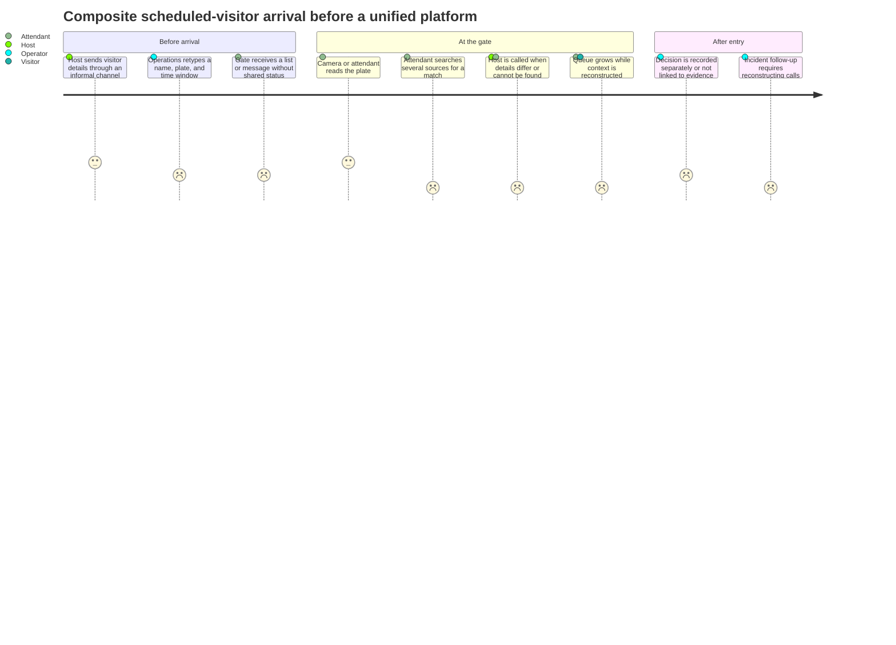

# Research and evidence

← [Platform documentation index](README.md)

## Methodology disclosure

This case study does **not** present the following material as verified field research.

- The project motivation is **author-provided context**, paraphrased rather than quoted.
- Stakeholder profiles, interview dates, journey details, quotations, and prototype feedback below
  are **illustrative/composite** design artifacts.
- Names and operational examples are anonymized or synthetic.
- Repeated themes mean recurrence across the composite role scenarios, not statistical frequency in
  interview transcripts.
- No real UM6P employee, student, visitor, guard, or administrator is represented as a research
  participant.

The purpose is to make product reasoning reviewable while leaving a clear validation plan for a
future, consented pilot.

## Author-provided context

**Label: author-provided first-person account, lightly edited for clarity; not independently
verified.**

> As a UM6P student, I once spent hours waiting at a campus gate because security staff could not
> locate the email containing my vehicle authorization. I later worked with campus stakeholders to
> map the existing process, understand the needs of administrators and security officers, and design
> a faster, AI-assisted alternative.

This is the author's account; it has not been independently verified in this repository. In
particular, the statement about later stakeholder work is not evidence that the illustrative roles,
dates, quotations, or feedback below are records of those activities. Those artifacts remain
explicitly composite. The claim that other students or employees experienced similar issues is
retained only as an **illustrative/composite pattern to validate**, not as a factual prevalence or
field-research claim.

The author's stated portfolio goal is to demonstrate competent software engineering beyond running
a model: clean boundaries, a credible multi-gate product, operator judgment, degraded operation,
documentation, and deployability.

This context justifies the case-study direction; it is not evidence that a particular campus has
adopted the product or that the described current-state workflow was directly observed.

## Methods used for the case study

| Method | Evidence type | Purpose | Limitation |
| --- | --- | --- | --- |
| Existing-code review | Repository evidence | Identify reusable recognition components and current constraints | Describes code, not operator behavior |
| Workflow decomposition | Engineering analysis | Separate invitation, passage, recognition, decision, and incident states | Must be tested against real policy |
| Composite role scenarios | Illustrative/composite | Exercise competing needs and failure cases | Not interview evidence |
| Prototype walkthroughs | Illustrative/composite | Expose hierarchy, language, and degraded-state issues | Feedback is synthesized |
| Threat/failure modeling | Engineering analysis | Define safe boundaries and recovery behavior | Requires deployment-specific review |
| Planned shadow pilot | Future primary evidence | Measure usability, latency, accuracy, and operations | Not yet completed |

## Illustrative stakeholder set

Every date in this table is an **illustrative design timestamp, not an actual interview date**.

| Composite role | Illustrative date (not a real interview) | Scenario focus | Evidence label |
| --- | --- | --- | --- |
| Gate attendant on a morning shift | 2026-07-08 | Queue pressure, uncertain plates, safe manual decisions | Illustrative/composite |
| Multi-gate security operator | 2026-07-09 | Prioritization, incidents, handoff, audit context | Illustrative/composite |
| Department host/coordinator | 2026-07-10 | Visitor invitation, time windows, changed plans | Illustrative/composite |
| Campus access administrator | 2026-07-11 | Sites, roles, policies, revocation, white-label settings | Illustrative/composite |
| Camera/network technician | 2026-07-14 | Discovery, credentials, RTSP health, reconnects, clock drift | Illustrative/composite |
| Service on-call engineer | 2026-07-15 | Queue age, failed jobs, backup, restore, rollback | Illustrative/composite |

These roles are design coverage, not personas with invented biographies. Future discovery should
sample different shifts, accessibility needs, languages, gates, and device vendors.

## Anonymized current journey map

**Label: illustrative/composite current-state journey.** It models a plausible fragmented process;
it does not claim to document UM6P's actual operating procedure.

### Journey opportunities

| Stage | Composite pain | Product opportunity |
| --- | --- | --- |
| Request | Free-form details are incomplete or duplicated | Typed, time-bounded request with validation |
| Distribution | Gate has stale or partial information | One grant state shared by host, operator, and gate |
| Arrival | Plate observation and invitation are in different systems | Passage view joins evidence and eligible grants |
| Exception | Confidence or mismatch lacks an explanation | Explicit review reasons and safe actions |
| Follow-up | Decisions, device health, and incidents are disconnected | Correlated event trail and passage-linked incident |

## Pain points and repeated themes

“Repeated” below means the theme appears in multiple composite scenarios. It is a prioritization aid,
not a quantitative research claim.

| Theme | Composite scenarios in which it appears | Consequence | Design response |
| --- | --- | --- | --- |
| Fragmented context | Attendant, operator, host, on-call | Retyping, phone calls, ambiguous ownership | Shared passage/request/event model |
| Time pressure at exceptions | Attendant, operator, visitor | Queue growth and hurried decisions | Exception-first review with bounded choices |
| Recognition mistaken for authorization | Attendant, admin, engineering | Unsafe or unexplained automation | Separate observation, grant match, decision, command |
| Hidden degraded state | Attendant, technician, on-call | Stale data may look live | Source/health banners, heartbeat age, last-known-good state |
| Device fault ambiguity | Operator, technician, on-call | Slow triage and unnecessary escalation | Layered camera/edge/API/worker health |
| Changes lack scope | Host, admin, operator | Invitations or policies reach the wrong gate/time | Organization/site/gate scope and versioned configuration |
| Language and handoff friction | Attendant, operator, host | Missed information between shifts or roles | EN/FR/AR presentation and explicit ownership/status |
| Evidence reconstruction | Operator, admin, on-call | Difficult incident review | Correlation IDs and append-oriented events |

## Assumptions to validate

| Assumption | Risk if wrong | Validation method |
| --- | --- | --- |
| **Illustrative/composite hypothesis:** authorization lookup delays recur across student and employee arrivals | A single author experience is presented as a broader pattern | Measure baseline search/wait causes with consent and report denominators |
| Plate-based arrival is a useful trigger at selected gates | Product optimizes the wrong moment | Observe shadow-mode arrivals and exception sources |
| Operators prefer one prioritized view over separate vendor screens | Added console becomes another screen | Task-based usability sessions on real shift scenarios |
| Host-entered plate data is available often enough to match | Most arrivals still require calls | Measure invitation completeness and correction rate |
| Central inference latency is acceptable with edge-selected frames | Review arrives too late | Measure capture-to-visible p50/p95 under pilot network conditions |
| A site edge agent can be deployed on each camera LAN | Architecture cannot reach private cameras safely | Network/site survey and installation rehearsal |
| EN/FR/AR covers initial operator needs | Critical language remains unsupported | Language review with actual users and content owners |
| SQLite is sufficient for a local demonstrator | Prototype load causes lock contention | Load test; use PostgreSQL before replicated production |

## Future real-discovery protocol

Before a live pilot, the team should:

1. obtain permission for observation and recording notes;
2. recruit participants by role and shift without managers present for every session;
3. record role, context, and date—not unnecessary personal data;
4. separate observed facts, participant statements, and researcher interpretation;
5. allow participants to correct workflow summaries;
6. test accessibility and language with actual users;
7. measure baseline queue/decision behavior before comparing the prototype;
8. publish findings with counts and limitations only after the data exists.

Real findings should supersede, not be blended silently with, the composite artifacts in this file.

## Related documents

- [Design evolution and traceability](design-evolution.md)
- [Product overview](product-overview.md)
- [Pilot and rollout](pilot-rollout.md)
- [Demo-data disclosure](video/demo-data-disclosure.md)
