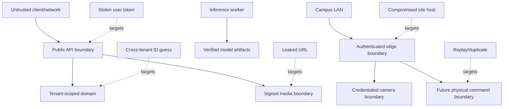

# Pragmatic security and privacy

← [Platform documentation index](README.md)

## Position

This project does not claim certification, regulatory compliance, a completed penetration test, or
production hardening. The useful engineering question is narrower: what can go wrong in a
multi-organization, camera-connected access system, and which concrete controls reduce that risk?

Security is part of product correctness because failures can expose campus networks, arrival
evidence, credentials, or physical commands. “Compliance” labels without enforcement are not a
substitute for the controls below.

## Assets and trust boundaries

| Asset | Primary risk | Boundary/control |
| --- | --- | --- |
| Camera/RTSP credentials | Network takeover or unauthorized viewing | Secret reference at edge; never returned to browser/logs |
| Tenant topology and access data | Cross-organization disclosure/change | Server-derived tenant context, role checks, RLS/repository scoping |
| Plate observations and images | Unnecessary tracking or evidence leak | Minimize collection, short retention, signed URLs, purpose-limited access |
| Grants and decisions | Unauthorized entry or untraceable denial | Explicit state transitions, actor/reason, audit/event trail |
| Gate commands | Replay or unsafe actuation | Separate service/adapter, TTL, nonce/idempotency, acknowledgement, safety inputs |
| Edge agent identity | Fake device or configuration theft | Enrollment, mTLS, rotation, revocation, outbound-only connection |
| Model artifacts | Tampered or untraceable predictions | Size/hash/semantic manifest validation and versioned rollout |
| Backups | Bulk disclosure or unusable recovery | Encryption/access control plus restore drills and retention |

## Threat model summary

## Identity and access

### Prototype

The control API's named demo bearer tokens are deliberately discoverable test fixtures. They prove
permission and tenant-scope behavior but provide no credential security. Bind the prototype to
loopback or a trusted development network.

### Production requirement

- OIDC Authorization Code + PKCE for browser users;
- issuer, audience, signature, expiry, and nonce validation;
- short-lived access tokens and defined logout/revocation behavior;
- server-derived roles and organization scope;
- workload identities/mTLS for edge agents and workers;
- least-privilege permissions expressed as capabilities, not scattered role-name checks;
- step-up/two-person confirmation for selected administrative or physical operations where the
  deployment risk assessment requires it.

The API must not trust an organization ID because the browser sent it. A platform-admin switch is an
explicit privileged action; other cross-organization probes should be denied or return scoped 404.

## Tenant isolation

Use defense in depth:

1. organization context produced by authentication middleware/dependency;
2. organization ID required in repository method signatures;
3. organization filters on every query and mutation;
4. PostgreSQL row-level security in the production adapter;
5. object keys, cache keys, event subjects, and quotas prefixed/scoped by organization;
6. tests that create identical IDs/codes in two organizations and attempt every cross-tenant path;
7. signed media URLs checked against the requesting principal and short expiry.

An organization column is not isolation unless every access path enforces it.

## Camera and edge secrets

- Store an encrypted credential reference; do not put `user:password@host` in an RTSP URI persisted
  centrally.
- Redact URI user info, authorization headers, tokens, and vendor error payloads before logging.
- Limit edge filesystem permissions and rotate credentials/certificates.
- Use outbound-only authenticated connectivity; do not port-forward cameras to the public internet.
- Segment camera networks from general user networks and restrict the agent's destinations.
- Prefer ONVIF Profile T security/TLS capabilities where supported; treat capability claims as
  something to probe, not assume.
- Provide a revocation path for a lost/replaced edge device.

See [Camera and edge onboarding](camera-edge-onboarding.md#credentials-and-network-boundary).

## Safe decision and actuation

Recognition and authorization are separated in the data model, but physical safety requires more:

- no command solely from model confidence;
- default outcome for missing/stale dependencies is review or the deployment-defined safe state,
  never implicit allow;
- command includes unique ID, desired action, issued/expiry time, policy/config version, actor, and
  correlation ID;
- edge rejects expired, duplicate, unauthorized, or out-of-order commands;
- barrier controller/safety loop confirms physical ability to act;
- acknowledgement records accepted/rejected/executed/failed without assuming delivery equals action;
- old commands are never replayed after reconnect;
- manual and emergency procedures remain available outside the platform.

Automatic actuation is excluded from the first pilot.

## Data minimization and retention

Collect what the workflow needs:

- prefer selected frames/crops over continuous central recording;
- avoid person biometrics when the product purpose is vehicle access;
- keep original image access narrower than event metadata access;
- use bounded retention by evidence category, with explicit incident pinning and expiry;
- make demo data unmistakably synthetic and keep it out of live tenant storage;
- expose purpose/source/model/version so evidence is not detached from context;
- aggregate operational metrics rather than retaining raw events forever “just in case.”

Retention values are deployment decisions. They should be configured, capacity-tested, and verified
by deletion jobs and restore policy rather than copied from a generic checklist.

## Logging and observability

Log identifiers and operational state needed to diagnose a path, but avoid full evidence payloads.

Allowed examples:

- request/trace/capture/passage IDs;
- organization/site/gate/camera IDs;
- model and config version;
- status transitions, queue age, latency, retry/error class;
- authorization actor subject and reason code where appropriate.

Avoid or redact:

- bearer tokens, cookies, camera passwords, signed URLs;
- raw RTSP/ONVIF requests containing credentials;
- full plate text in general-purpose logs;
- visitor email/phone/address;
- image bytes or base64;
- stack traces in HTTP responses.

Access to logs and dashboards is itself privileged and time-bounded.

## Dependency and model supply chain

- Commit and verify dependency locks for each independently deployed project.
- Keep model artifacts pinned by SHA-256, byte size, role, task, and expected class contract.
- Disable runtime model/dependency auto-download.
- Build images from reviewed sources, run as non-root, and produce immutable image identities.
- Scan dependencies/images as an engineering signal, triage findings, and avoid presenting a scan
  badge as proof of safety.
- Promote model/config versions through deterministic smoke, shadow, and canary stages.

## Browser security baseline

- Serve over HTTPS with secure, HTTP-only, same-site cookies if a BFF/session design is used.
- Configure a restrictive Content Security Policy and frame policy.
- Restrict CORS to known origins; never combine wildcard origins with credentials.
- Escape untrusted display values and avoid injecting HTML. The prototype console includes an
  escaping boundary that should remain mandatory.
- Keep auth tokens out of long-lived browser storage where possible.
- Treat client-side localization and role controls as presentation, not authorization.

## Backup security

Backups concentrate data. Encrypt them in transit/at rest in the target environment, restrict restore
permissions, record restore access, and test a redacted/non-production restore path. Never send a
live database or evidence archive in an ordinary support bundle. See
[Backup and restore](backup-restore.md).

## Security verification checklist

Before a pilot:

- [ ] demo bearer tokens are disabled or the service is isolated to a local demo;
- [ ] every route has an explicit public/authenticated/permission classification;
- [ ] cross-organization tests cover reads, writes, lists, errors, events, and media;
- [ ] camera and edge secrets are absent from API responses and logs;
- [ ] signed media URLs expire and are tenant scoped;
- [ ] duplicate/replayed capture messages are idempotent;
- [ ] no automated barrier command exists in shadow mode;
- [ ] dependency/model locks and integrity checks pass;
- [ ] backup and restore have been rehearsed;
- [ ] an incident contact and credential/device revocation path exist;
- [ ] externally reachable hosts have been reviewed and minimally exposed.

## Incident priorities

| Priority | Example | Immediate action |
| --- | --- | --- |
| Critical | Unauthorized physical command or active cross-tenant exposure | Isolate command/API path, preserve bounded evidence, revoke credentials, invoke site safety procedure |
| High | Camera credential leak or compromised edge identity | Revoke/rotate, isolate device/network, inspect access and configuration history |
| Medium | Incorrect role permission or signed media URL too broad | Disable affected operation, expire URLs/tokens, patch and test isolation |
| Operational | Model degradation or delayed inference with no unsafe command | Switch to review/manual procedure, preserve metrics, diagnose worker/input change |

Detailed fault isolation is in [Troubleshooting](troubleshooting.md).

## Related documents

- [Architecture](architecture.md)
- [API overview](api-overview.md)
- [Camera and edge onboarding](camera-edge-onboarding.md)
- [Backup and restore](backup-restore.md)
- [Pilot and rollout](pilot-rollout.md)
