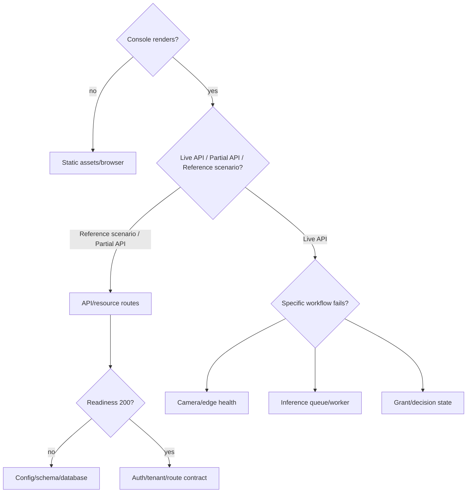

# Platform troubleshooting

← [Platform documentation index](README.md)

## First response: locate the failed layer

Do not restart every component at once. Preserve the correlation IDs/times and determine the first
unhealthy boundary.



Record current time/time zone, browser URL, role/token label (never token value in a support bundle),
organization/site/gate, request/passage/correlation ID, and the first failing request/status.

Start with the deterministic repository diagnostic, then include the live readiness check when the
API should be running:

```powershell
uv run --frozen python scripts/platform_doctor.py
uv run --frozen python scripts/platform_doctor.py --api-url http://127.0.0.1:8000
```

The first command isolates checkout/runtime failures from service failures. Add `--json` when the
result will be attached to CI or a sanitized support bundle.

## Health probes

```powershell
Invoke-RestMethod http://127.0.0.1:8000/health/live
Invoke-RestMethod http://127.0.0.1:8000/health/ready
Invoke-RestMethod http://127.0.0.1:8000/api/v1/meta
```

- Liveness failure: process/port/crash problem.
- Liveness works, readiness 503: persistence path/schema/startup problem.
- Both work, protected routes 401/403: demo auth/permission/tenant context.
- Both work, console Reference scenario/Partial API: one or more canonical resource requests,
  authentication, timeout, normalization, or browser-origin problem.

## Console does not load

Check:

1. `CAMPUS_CONSOLE_DIR` resolves to a directory containing `index.html`, `app.mjs`, `styles.css`,
   and imported modules.
2. Browser network panel has no 404 or blocked module/CSP/MIME errors.
3. Direct `/docs` still loads; if so, API is running but static mount/config may be wrong.
4. JavaScript syntax/tests pass:

```powershell
npm --prefix web/console run check
```

If the configured console directory is missing, the API serves a small landing response rather than
the console.

## Console shows Reference scenario or Partial API

The prototype requests each console resource independently and falls back to deterministic fixtures.

- **Reference scenario** means none of the expected API resources loaded. Its internal source-state
  key is `demo`.
- **Partial API** (the internal `hybrid` state) means only some loaded; successful resources are
  merged over the deterministic snapshot.
- **Live API** means all configured resources responded successfully.
- **Offline fallback** means the browser reported no network and API requests were skipped.

Inspect failed browser requests. The current client calls canonical `/api/v1` routes for dashboard,
session, organizations, sites, gates, cameras, access requests, access grants, passages, events,
incidents, and device health, then normalizes those responses into UI read models. One `401`, `403`,
`404`, CORS failure, timeout, invalid response shape, or unavailable resource is sufficient to show
Partial API. Use the browser network panel and compare each failure with the generated OpenAPI
contract; do not assume partial mode is merely cosmetic.

Never use fallback records for live gate decisions. Production configuration should disable demo
fallback and show an unavailable/stale state.

## 401 or 403

- Use a token returned by `/api/v1/demo-identities` only in the local prototype.
- Send `Authorization: Bearer TOKEN`.
- Confirm the role has the named capability.
- A host sees only its own requests.
- Only `platform_admin` may select another organization with `X-Organization-ID`.
- A 404 may intentionally hide a resource outside the selected organization.

Do not “fix” a 403 by assigning platform admin broadly.

## Wrong organization or empty lists

1. Read `/api/v1/session` to confirm principal organization/roles.
2. Remove an accidental `X-Organization-ID` header unless deliberately testing platform admin.
3. Verify demo seed is enabled for the local fixture database.
4. Confirm the resource belongs to the same organization/site/gate chain.
5. Test with `demo-rif-admin` to ensure Rif data is isolated rather than absent globally.

## Readiness fails or database is missing

Check `CONTROL_API_DB_PATH` and directory permissions. Defaults resolve from the repository root, not
the shell's current directory. Confirm the path is not a directory and the disk is writable.

The service creates the parent directory, initializes the schema, and records a schema version during
lifespan. Readiness requires that expected version. Do not create tables manually to bypass a failed
migration.

## SQLite is locked

The prototype uses short-lived connections, foreign keys, a busy timeout, and WAL. Persistent lock
errors usually indicate:

- another process holding a long transaction;
- multiple API writer processes sharing one SQLite database;
- database on unsupported/network storage;
- backup/copy tooling manipulating live files incorrectly;
- disk/permission failure reported as an operational error.

Stop duplicate local writers safely, let the current transaction finish, and inspect logs. Do not
delete `-wal`/`-shm` files while the database is open. For multi-replica deployment, migrate to
PostgreSQL rather than tuning around SQLite's single-writer boundary.

## Seed data is missing or unexpected

- `CONTROL_API_SEED_DEMO=true` inserts deterministic fixtures idempotently.
- `false` leaves a newly initialized database empty.
- Changing seed source does not update rows already inserted via `INSERT OR IGNORE`.

For deterministic recording, create a dedicated disposable database path and seed once. Do not erase
an unknown/shared database to reset a demo. See [Recording guide](video/recording-guide.md).

## Camera or edge agent is offline

**Target integration only.** Check in order:

1. edge agent heartbeat, certificate expiry, software/config desired/applied versions;
2. agent disk/spool watermarks and clock drift;
3. camera power/network and address change;
4. credential/authentication failure without exposing secret;
5. ONVIF discovery/service reachability;
6. RTSP setup, transport, codec/decode, first/last frame;
7. jittered reconnect state and next retry;
8. only then central upload/control dependencies.

Do not repeatedly restart a camera without preserving the failure state/time. Follow
[Camera onboarding](camera-edge-onboarding.md#camera-connection-state-machine).

## Recognition is slow or missing

Separate:

- no capture/trigger;
- capture queued locally at edge;
- upload/object missing;
- broker queue age;
- worker not ready/model load failure;
- inference returned empty/uncertain;
- passage projection/event delivery failure.

Use capture/passage/job IDs and compare queue time with model stage time. Check model manifest integrity,
worker warm-up, device/memory, input dimensions, and camera-specific inference profile. Do not lower a
confidence threshold until representative labeled evidence shows the trade-off.

## Plate quality is poor

- Confirm camera focus, shutter/exposure, angle, zoom, plate pixel size, glare, dirt, and lighting.
- Confirm the ROI and direction match the lane.
- Use plate-first profile for a tight ANPR view rather than requiring vehicle detection.
- Check supported plate format/output map and retain candidates instead of forcing a pattern.
- Group frames into a passage and choose temporal/best-quality evidence.
- Evaluate by day/night/weather and gate, not only aggregate exact match.

The repository demo images prove a regression path, not deployment accuracy.

## Event feed repeats or appears to skip

- Repeats are valid under at-least-once delivery; consumers deduplicate by event/message ID.
- REST event pagination advances with `next_sequence`, not client wall clock.
- If a consumer stops mid-page, resume from the last committed sequence.
- A gap in an organization's visible sequence may reflect events for another tenant if sequence is
  globally allocated; do not infer loss from non-consecutive numbers alone.
- Compare source record and outbox/inbox state before replaying.

## Arabic layout or localization is incorrect

- Confirm locale normalization resolved to `ar` and document direction is `rtl`.
- Test keyboard/focus order, icons, tables, numeric/plate strings, date/time, and mixed-script labels.
- Missing message keys fall back to English in the prototype; treat visible keys as a test failure.
- Logo text inside an image does not mirror automatically and needs reviewed alternative text.

## Browser action times out

The prototype API client has a bounded request timeout. Determine whether:

- the API operation completed after the browser aborted;
- the action is idempotent;
- a mutation response was lost;
- the operation should be asynchronous (`202` + status resource).

Refresh/read current state before repeating a decision. Never repeat a future physical command merely
because the browser timed out.

## Safe support bundle

Include:

- application/console/config/model/schema versions;
- timestamps/time zones and correlation/resource IDs;
- redacted health/status, queue/spool measurements, error classes;
- exact reproduction steps and expected/actual behavior;
- sanitized browser request method/path/status;
- whether the visible data source was Live API, Partial API, Reference scenario, or Offline fallback.

Exclude tokens, cookies, camera credentials/RTSP URLs, signed media URLs, raw database/evidence, visitor
details, and unrelated logs.

## Related documents

- [Deployment runbook](deployment-runbook.md)
- [Backup and restore](backup-restore.md)
- [Operator guide](guides/operator.md)
- [Camera and edge onboarding](camera-edge-onboarding.md)
- [Security and privacy](security-and-privacy.md)
